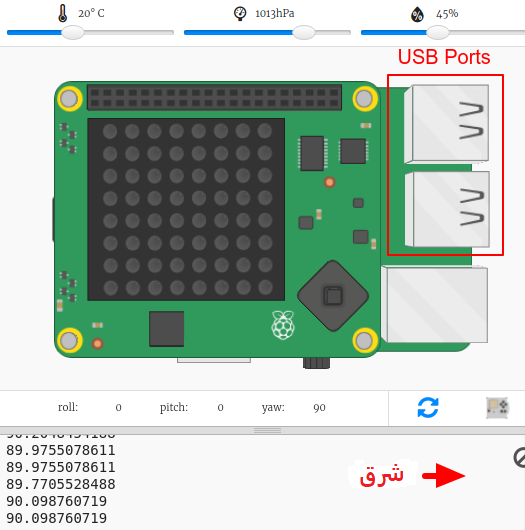
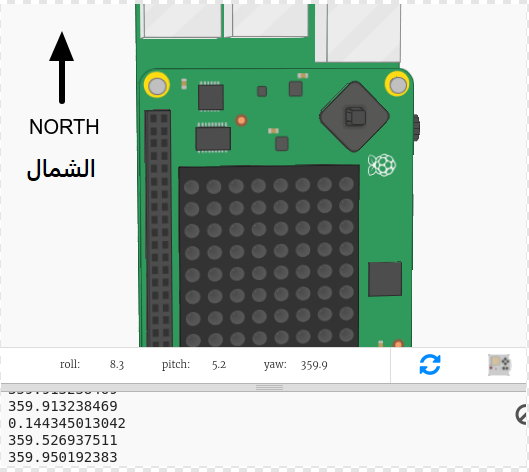
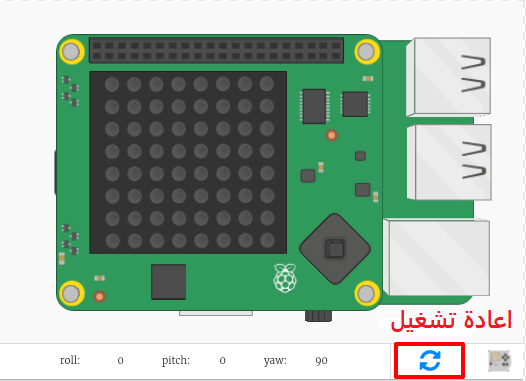

## إيجاد اتجاه البوصلة

يحتوي Sense HAT على مقياس مغناطيسي يمكن استخدامه لتحديد الاتجاه الشمالي.

في المحاكي الشمال يتوافق مع الجزء العلوي من الشاشة، المحاكي هو (برنامج كمبيوتر يحاكي شيئًا آخر ، عادةً ما يكون جهازًا حقيقي مثل Sense Hat أو وحدة تحكم ألعاب). الــSense HAT تشير إلى ان البوصلة تتجه بدرجات من الشمال.

فيما يلي تذكير بنقاط البوصلة:

+ افتح مشروع trinket هذا: <a href="http://jumpto.cc/compass-go" target="_blank">jumpto.cc/compass-go</a>.

+ دعونا نعرف الاتجاه الذي يشير إليه Sense HAT. أضف التعليمات البرمجية التالية إلى أسفل ` main.py `:
    
    

+ قم بتشغيل التعليمات البرمجية الخاصة بك لرؤية عنوان البوصلة - كم عدد الدرجات من مواجهة الشمال.
    
    
    
    في بداية تشغيل البرنامج ، ستجد Sense HAT جهة الشرق ويجب أن ترى قيمًا تبلغ حوالي 90 درجة.
    
    يعتمد الاتجاه على منافذ USB.

+ اسحب جهاز Sense HAT لتغيير اتجاهها.
    
    
    
    حاول إيجاد اتجاهات مختلفة:
    
    + اتجاه الشمال: حوالي 360 أو 0 درجة 
    + اتجاه الشرق: حوالي 90 درجة
    + اتجاه الجنوب: حوالي 180 درجة
    + اتجاه الغرب: حوالي 270 درجة

+ إذا واجهت تشوش ذهني يمكنك دائماً النقر على زر إعادة التعيين لوضع Sense HAT في موضع البداية.
    
    