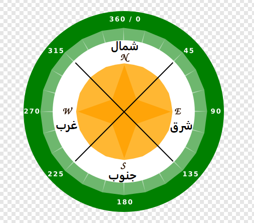
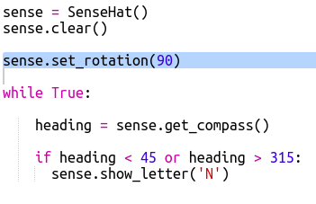

## عرض اتجاه البوصلة

بعد ذلك ، دعنا نظهر اتجاه البوصلة ، الشمال ، الشرق،الجنوب او الغرب ، على شاشة Sense HAT. مختصرات مهمة N مختصر North E مختصر East S مختصر South W مختصر West.

إذا كان راس البوصلة بالدرجات بين 315 و 45 ، فإن Sense HAT يشير إلى الشمال وانت تريد عرض "N" مختصر North. إذا كان راس البوصلة بين 45 و 315 ، فأنت تريد عرض حرف "E" مختصر East (الشرق) وهكذا.

+ دعنا أولاً نظهر N على الشاشة عندما يواجه Sense HAT الشمال.
    
    تذكر أنه عندما يكون Sense HAT باتجاه الشمال، تكون منافذ USB في الأعلى:
    
    

+ قم بتغيير التعليمات البرمجية الخاصة بك لعرض 'N' عندما يكون عنوان البوصلة بين 45 و 135:
    
    

+ اسحب Sense HAT إلى الشمال (منافذ USB في أعلى الشاشة) لاختبار البوصلة.
    
    

لن تختفي "N" ، تحتاج إلى إضافة تعليمات برمجية للاتجاهات الأخرى.

+ ظهرت الــ، "N" جانبية في شاشة الــ Sense Hat. وسيكون من المنطقي أكثر أن يكون الحرف موجهاً في نفس الاتجاه الذي تواجهه منافذ الــ USB.
    
    أضف التعليمات البرمجية التالية لتدوير شاشة Sense HAT.
    
    
    
    الآن سيتم ترتيب حرف البوصلة مع منافذ USB مما يجعل الأمر أكثر منطقية عند استخدام Sense HAT كبوصلة.

+ دعنا أولاً نعرض N على الشاشة عندما يواجه Sense HAT الشمال. إذا لم تكن باتجاه الشمال، يجب أن يكون راس (Sense Hat) اكبر من 45 درجة بحيث يمكنك التحقق فقط من أنه أقل من 315:
    
    

+ أضف التعليمات البرمجية للجنوب. انظروا إلى البوصلة لنعمل على ما يجب أن يكون عليه الشرط.

+ يجب أن تبدو التعليمات البرمجية خاصتك بالشكل التالي:
    
    

+ الآن أضف التعليمة البرمجية للغرب. إذا لم يكن شمالاً، شرقاً أو جنوباً، يجب أن يكون غرباً! يمكنك فقط استخدام 'والا'.
    
    

+ اختبر تعليماتك البرمجية بسحب لوحة Sense HAT حولها.
    
    لقد صنعت بوصلة Sense HAT!