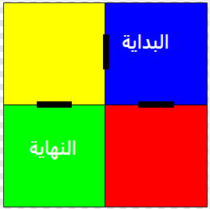
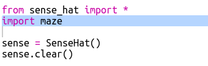
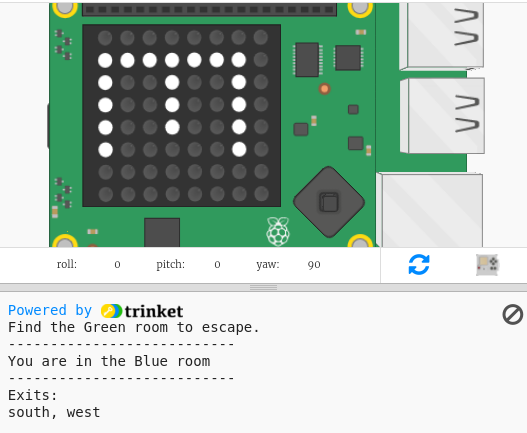
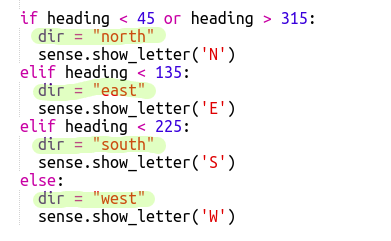
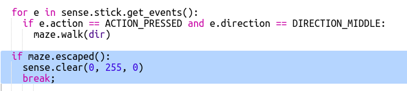

## التنقل في المتاهة

الآن دعونا نستخدم البوصلة للتنقل حول المتاهة.

الغرف والأبواب في المتاهة على النحو المبين في هذه الخريطة:

أنت تبدأ في الغرفة الزرقاء وتحتاج إلى العثور على الغرفة الخضراء للخروج.

+ التعليمات البرمجية لإنشاء لعبة مغامرة بسيطة (مثل اللعبة في مشروع RPG) موجودة في ملف maze.py في مشروعك.
    
    `maze.py` يتضمن بعض الدوال البرمجية لمساعدتك على كتابة لعبة المتاهة:
    
    + `maze.start()` - يبدأ اللعبة
    + `maze.escaped()` - يخبرك ما إذا كان اللاعب قد خرج من المتاهة
    + `maze.walk(dir)` - ينقل اللاعب في الاتجاه المحدد
    + `maze.getColour()` - يعطيك لون الغرفة الحالية
    
    ستحتاج إلى استيراد `maze.py`:
    
    

+ ابدأ اللعبة ب `maze.start()`:
    
    

+ سترى تعليمات اللعبة تظهر أسفل جهاز Sense HAT.
    
    

+ للتحرك حول المتاهة تحتاج إلى استخدام `maze.walk(dir)` مع الاتجاه الذي تريد الانتقال إليه.
    
    ضع اتجاه البوصلة الحالي في متغير `dir` ، ستحتاج إلى تعيينه لكل اتجاه بالبوصلة:
    
    

+ الآن لنجعل اللاعب يتحرك في الاتجاه الذي تشير إليه بوصلة Sense HAT عند الضغط على الزر الأوسط على عصا التحكم.
    
    

+ حاول التحرك حول المتاهة باستخدام البوصلة.
    
    للضغط على عصا التحكم تحتاج إلى النقر في نافذة Sense HAT ثم اضغط على Enter (العودة) على لوحة المفاتيح.

+ اختبر مشروعك عن طريق نقل Sense HAT إلى الاتجاه الذي تريد الانتقال إليه ثم انقر على Enter على لوحة المفاتيح.
    
    انظر إلى الخريطة إذا كنت بحاجة إلى مساعدة للعثور على الغرفة الخضراء.

+ عندما يصل اللاعب إلى الغرفة الخضراء تمكن من الخروج من المتاهة. دعونا ندير الشاشة الخضراء عندما يفوزون وينهون اللعبة:
    
    
    
    الــ `break` تم الانتهاء من التعليمة تكرار لإنهاء اللعبة.