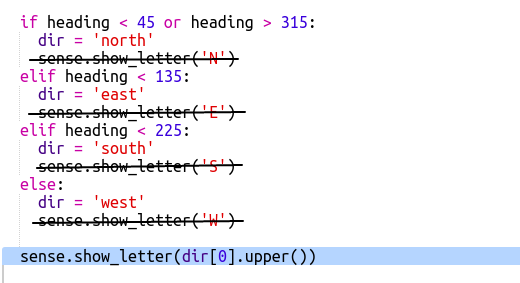
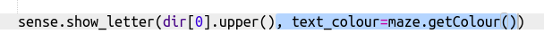

## إضافة ألوان

سيكون من الأفضل أن تتمكن من معرفة الغرفة التي كنت فيها بمجرد النظر إلى Sense HAT.

دعونا نعرض حرف البوصلة بلون الغرفة الحالية.

على سبيل المثال، إذا كنت في الغرفة الزرقاء وتواجه الجنوب فيجب أن ترى الحرف الأزرق S.

+ ستحتاج إلى توفير`text-colour ` to` sens.show_letter `. بدلاً من القيام بذلك أربع مرات ، قم بتغيير التعليمة البرمجية لاستخدام متغير dir لعمل الحرف الذي يظهر على Sense HAT.
    
    `dir[0].upper()` يأخذ الحرف الأول من الكلمة ويحوله إلى حرف كبير بحيث يعطيك "الشمال" تساوي "N".
    
    قم بتغيير رمز البوصلة الخاص بك لاستخدام `show_letter` مرة:
    
    

+ يجب أن تبدو التعليمات البرمجية خاصتك بالشكل التالي:
    
    

+ الآن استخدم لون الغرفة الحالية عند عرض رسالة البوصلة:
    
    

+ اختبر التعليمات البرمجية الخاصة بك ويجب أن تجد أنك تستطيع أن تعرف الغرفة التي تدخلها من خلال لون الرسالة.
    
    