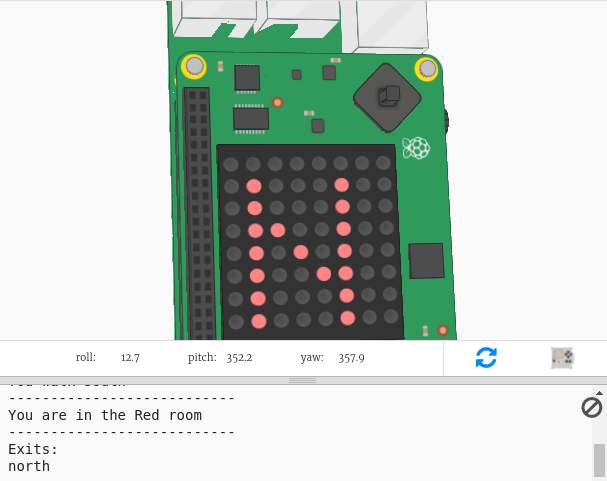

## Úvod:

In this project you will use the the Sense HAT as a compass to navigate out of a maze of colourful rooms. You will need to point the Sense HAT in the direction you want to move and then press the button in the middle of the joystick to make a move.

  <iframe src="https://trinket.io/embed/python/0c8cdacd70?outputOnly=true&start=result" width="600" height="500" frameborder="0" marginwidth="0" marginheight="0" allowfullscreen mark="crwd-mark">
</iframe> 

To play the game press Run and read the text that appears in the trinket output window.

Your current compass direction will appear on the Sense HAT display (N, S, E or W.) You can change direction by moving the Sense HAT in the emulator.

When you are facing in the direction you want to go, press the middle button on the joystick by pressing enter on the keyboard.

### Další informace pro vedoucí klubů

Potřebujete-li tento projekt vytisknout, použijte [verzi pro tisk ](https://projects.raspberrypi.org/en/projects/compass-maze/print) {: target = "_ prázdný.

## \--- collapse \---

## title: Poznámky vedoucího klubu

## Úvod:

In this project, children will learn how to use the Sense HAT magnetometer (compass), and use the compass direction to navigate through a maze.

## Online zdroje

**This project uses Python 3.** We recommend using [Trinket](https://trinket.io/) to write Python online. Projekt obsahuje následující trinkety:

* ['Compass Maze' Starter Trinket -- jumpto.cc/compass-go](http://jumpto.cc/compass-go)

K dispozici je také trinket obsahující dokončený projekt:

* [‘Compass Maze’ Finished -- trinket.io/python/d11bf21615](https://trinket.io/python/d11bf21615)

## Offline zdroje

This project can also be [completed offline](https://www.codeclubprojects.org/en-GB/resources/physical-sense-hat/) on a Raspberry Pi computer with a Sense HAT. Ke zdrojům projektu se dostanete kliknutím na odkaz "materiály pro projekt". Tento odkaz obsahuje sekci "zdroje projektu", se zdroji, které děti budou potřebovat k dokončení projektu offline. Ujistěte se, že každé dítě má přístup ke kopii těchto zdrojů. Tato sekce obsahuje následující soubory:

* compass-maze/main.py
* compass-maze/maze.py

V sekci "zdroje dobrovolníků" také můžete najít dokončenou verzi tohoto projektu, která obsahuje:

* compass-maze-finished/main.py
* compass-maze-finished/maze.py

(Všechny výše zmíněné zdroje jsou také stažitelné jako `.zip` soubory.)

## Vzdělávací cíle

* How to use the Sense HAT magnetometer (`get_compass()`)

Tento projekt zahrnuje prvky z následujících částí výukových osnov [ Raspberry Pi Digitální bastlení ](http://rpf.io/curriculum):

* [Vyřešení problému kombinováním programovacích konstruktů.](https://www.raspberrypi.org/curriculum/programming/builder)

## Výzvy

* "Reward the player" - Displaying n image on the LEDs at the end of the game;
* "Create your own maze" - edit the maze dictionary to create their own maze.

\--- /collapse \---

## \--- collapse \---

## title: Materiály projektu

## Zdroje projektu

* [.zip soubor se všemi zdroji projektu](resources/compass-maze-project-resources.zip)
* [Compass Maze starter project](http://jumpto.cc/compass-go)
* [Offline starter Python file](resources/compass-maze-main.py)
* [Offline starter Python file containing the maze code](resources/compass-maze-maze.py)

## Zdroje pro vedoucího klubu

* [.zip soubor se všemi zdroji dokončeného projektu](resources/compass-maze-volunteer-resources.zip)
* [Online completed Trinket Compass Maze project](https://trinket.io/python/0c8cdacd70)
* [compass-maze-finished/main.py](resources/compass-maze-finished-main.py)
* [compass-maze-finished/maze.py](resources/compass-maze-finished-maze.py)

\--- /collapse \---