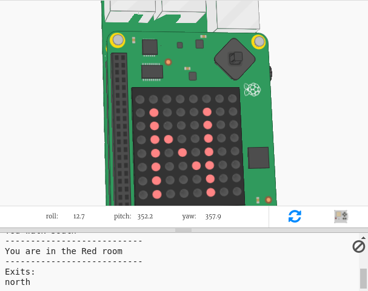

## Einleitung:

In this project you will use the the Sense HAT as a compass to navigate out of a maze of colourful rooms. You will need to point the Sense HAT in the direction you want to move and then press the button in the middle of the joystick to make a move.

  <iframe src="https://trinket.io/embed/python/0c8cdacd70?outputOnly=true&start=result" width="600" height="500" frameborder="0" marginwidth="0" marginheight="0" allowfullscreen mark="crwd-mark">
</iframe> 

To play the game press Run and read the text that appears in the trinket output window.

Your current compass direction will appear on the Sense HAT display (N, S, E or W.) You can change direction by moving the Sense HAT in the emulator.

When you are facing in the direction you want to go, press the middle button on the joystick by pressing enter on the keyboard.

### Zusätzliche Information für Clubleiter

Falls du dieses Projekt ausdrucken musst, verwende bitte die [druckfreundliche Version](https://projects.raspberrypi.org/en/projects/compass-maze/print).

## \--- collapse \---

## title: Anmerkungen für Clubleiter

## Einleitung:

In this project, children will learn how to use the Sense HAT magnetometer (compass), and use the compass direction to navigate through a maze.

## Online-Ressourcen

**This project uses Python 3.** We recommend using [Trinket](https://trinket.io/) to write Python online. Dieses Projekt enthält die folgenden Trinkets:

* ['Compass Maze' Starter Trinket -- jumpto.cc/compass-go](http://jumpto.cc/compass-go)

Außerdem ist ein trinket mit dem vollständigen Projekt verfügbar:

* [‘Compass Maze’ Finished -- trinket.io/python/d11bf21615](https://trinket.io/python/d11bf21615)

## Offline-Ressourcen

This project can also be [completed offline](https://www.codeclubprojects.org/en-GB/resources/physical-sense-hat/) on a Raspberry Pi computer with a Sense HAT. Sie können auf die Projektressourcen zugreifen, indem Sie auf den Link "Projektmaterial" für dieses Projekt klicken. Dieser Link enthält einen Abschnitt "Projektressourcen" mit Ressourcen, die die Kinder benötigen, um das Projekt offline abschließen zu können. Stelle sicher, dass jedes Kind Zugriff auf eine Kopie dieser Ressourcen hat. Dieser Abschnitt enthält die folgenden Dateien:

* compass-maze/main.py
* compass-maze/maze.py

Eine vollständige Version dieses Projekts finden Sie auch im Abschnitt "Ressourcen für Freiwillige Mitarbeiter" mit diesem Inhalt:

* compass-maze-finished/main.py
* compass-maze-finished/maze.py

(Alle oben genannten Ressourcen können auch als `.zip`-Dateien für Projekte und für Freiwillige heruntergeladen werden.)

## Lernziele

* How to use the Sense HAT magnetometer (`get_compass()`)

Dieses Projekt deckt die folgenden Kernbereiche des [Raspberry Pi Digital Making Curriculum](http://rpf.io/curriculum) ab:

* [Verschiedene Programmierkonstrukte kombinieren um ein Problem zu lösen.](https://www.raspberrypi.org/curriculum/programming/builder)

## Herausforderungen

* "Reward the player" - Displaying n image on the LEDs at the end of the game;
* "Create your own maze" - edit the maze dictionary to create their own maze.

\--- /collapse \---

## \--- collapse \---

## title: Projektmaterial

## Projektressourcen

* [.zip-Datei mit allen Projektressourcen](resources/compass-maze-project-resources.zip)
* [Compass Maze starter project](http://jumpto.cc/compass-go)
* [Offline starter Python file](resources/compass-maze-main.py)
* [Offline starter Python file containing the maze code](resources/compass-maze-maze.py)

## Ressourcen für Clubleiter

* [.zip-Datei mit allen fertig gestellten Projektressourcen](resources/compass-maze-volunteer-resources.zip)
* [Online completed Trinket Compass Maze project](https://trinket.io/python/0c8cdacd70)
* [compass-maze-finished/main.py](resources/compass-maze-finished-main.py)
* [compass-maze-finished/maze.py](resources/compass-maze-finished-maze.py)

\--- /collapse \---