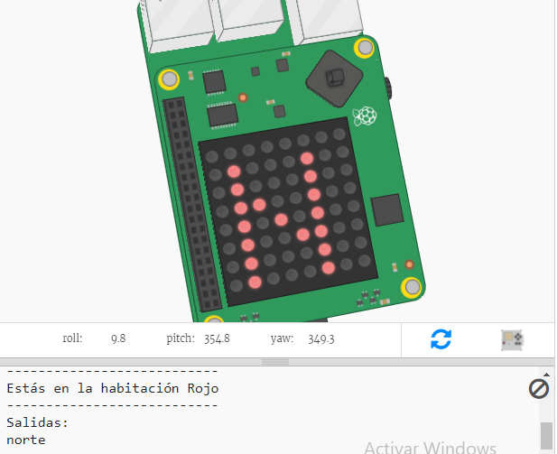

## Introducción

En este proyecto, usarás el Sense HAT como brújula para navegar fuera de un laberinto de habitaciones coloridas. Necesitarás apuntar el Sense HAT en la dirección en la que quieres moverte y luego presionar el botón en el medio del joystick para hacer un movimiento.

  <iframe src="https://trinket.io/embed/python/a551881053?outputOnly=true&start=result" width="600" height="500" frameborder="0" marginwidth="0" marginheight="0" allowfullscreen mark="crwd-mark">
</iframe> 

Para jugar, presiona Run y lee el texto que aparece en la ventana de salida de Trinket.

La dirección actual de la brújula aparecerá en la pantalla del Sense HAT (N para Norte, S para Sur, E para Este u O para Oeste.). Puedes cambiar la dirección moviendo el Sense HAT en el emulador de Trinket.

Cuando estés mirando en la dirección que deseas ir (N, S, E u O), presiona el botón en el joystick presionando Enter en el teclado.

### Información adicional para los líderes del club

Si necesitas imprimir este proyecto, usa la [versión para imprimir](https://projects.raspberrypi.org/es-LA/projects/compass-maze/print).

--- collapse ---
---
title: Notas para el líder del club
---

## Introducción:

En este proyecto, los niños aprenderán cómo usar el magnetómetro (brújula) del Sense HAT y cómo usar la dirección de la brújula para navegar a través de un laberinto.

## Recursos en línea

**Este proyecto usa Python 3.** Recomendamos el uso de [Trinket](https://trinket.io/) para escribir Python en línea. Este proyecto contiene los siguientes Trinkets:

* [Trinket de inicio 'Laberinto con brújula ' - trinket.io/python/8a987edde0](https://trinket.io/python/8a987edde0)

También hay un Trinket que contiene el proyecto completo:

* ['Laberinto con Brújula' Terminado - trinket.io/python/d11bf21615](https://trinket.io/python/d11bf21615)

## Recursos sin conexión

Este proyecto también se puede [completar sin conexión](https://www.codeclubprojects.org/en-GB/resources/physical-sense-hat/) en una computadora Raspberry Pi con un Sense HAT. Puedes acceder a los recursos del proyecto haciendo clic en el enlace «Materiales del proyecto» para este proyecto. Este enlace contiene una sección de «Recursos del proyecto», que incluye los recursos que los niños necesitarán para completar este proyecto sin conexión. Asegúrate de que cada niño tenga acceso a una copia de estos recursos. Esta sección incluye los siguientes archivos:

* compass-maze/main.py
* compass-maze/maze.py

También se puede encontrar una versión completa de este proyecto en la sección 'Recursos para voluntarios', que contiene:

* compass-maze-finished/main.py
* compass-maze-finished/maze.py

(Todos los recursos anteriores también se pueden descargar como proyectos `.zip` y archivos de voluntarios.)

## Objetivos del Aprendizaje

* ¿Cómo usar el magnetómetro del Sense HAT? (`get_compass()`)

Este proyecto trata elementos de los siguientes aspectos del [Currículo de creación digital de Raspberry Pi](http://rpf.io/curriculum):

* [Combinar estructuras de programación para resolver un problema.](https://www.raspberrypi.org/curriculum/programming/builder)

## Desafíos

* "Recompensa al jugador": muestra una imagen en los LEDs al final del juego;
* "Crea tu propio laberinto": edita el diccionario de laberintos para crear tu propio laberinto.

--- /collapse ---

--- collapse ---
---
title: Materiales del proyecto
---

## Recursos del proyecto

* [Archivo .zip que contiene todos los recursos del proyecto](resources/compass-maze-project-resources.zip)
* [Proyecto de inicio de Laberinto con Brújula](https://trinket.io/python/8a987edde0)
* [Archivo Python de inicio para uso sin conexión](resources/compass-maze-main.py)
* [Archivo Python de inicio que contiene el código del laberinto para uso sin conexión](resources/compass-maze-maze.py)

## Recursos para el líder del club

* [Archivo .zip que contiene todos los recursos del proyecto terminado](resources/compass-maze-volunteer-resources.zip)
* [Proyecto Trinket Laberinto con Brújula completo para uso en línea](https://trinket.io/python/a551881053)
* [compass-maze-finished/main.py](resources/compass-maze-finished-main.py)
* [compass-maze-finished/maze.py](resources/compass-maze-finished-maze.py)

--- /collapse ---
