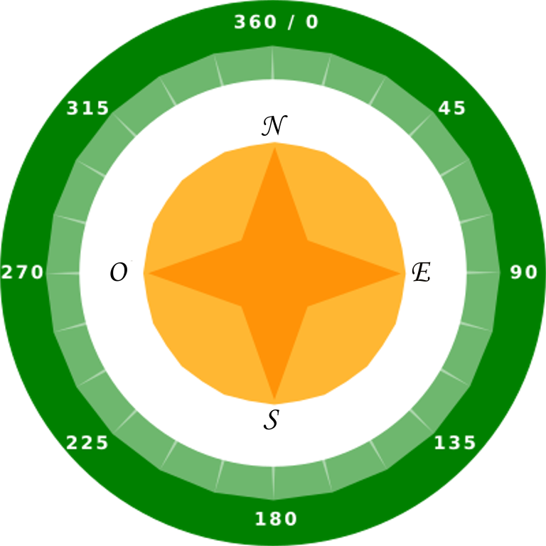

## Encontrando la dirección de la brújula

El Sense HAT contiene un magnetómetro que se puede usar para determinar en qué dirección está el norte.

En el emulador, el norte corresponde a la parte superior de tu pantalla. El Sense HAT indica como una brújula en grados desde el norte.

Aquí hay un recordatorio de los puntos de una brújula:

+ Abre el Trinket de Inicio del Laberinto con Brújula: <a href="http://jumpto.cc/compass-go" target="_blank">jumpto.cc/compass-go</a>.

+ Veamos en qué dirección apunta el Sense HAT. Agrega el siguiente código al final de `main.py`:
    
    

+ Ejecuta tu código para ver la dirección de la brújula - a cuántos grados estás del norte.
    
    
    
    En su posición inicial, el Sense HAT está orientado hacia el este y deberías ver valores de aproximadamente 90 grados.
    
    La dirección se basa en los puertos USB.

+ Arrastra el Sense HAT para cambiar su dirección.
    
    
    
    Intenta encontrar diferentes direcciones:
    
    + Norte: alrededor de 360 o 0 grados 
    + Este: alrededor de 90 grados
    + Sur: alrededor de 180 grados
    + Oeste: alrededor de 270 grados

+ Si tienes problemas, siempre puedes hacer clic en el botón de reinicio para volver a colocar el Sense HAT en su posición inicial.
    
    