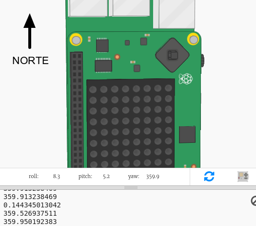

## Mostrando la dirección de la brújula

Ahora, mostremos la dirección de la brújula, N (norte), E (este), S (sur) o W (oeste), en la pantalla Sense HAT.

Si la indicación de la brújula está entre 315 y 45 grados, entonces el Sense HAT está apuntando hacia el norte y se desea mostrar una 'N'. Si la indicación está entre 45 y 315 grados, entonces se desea mostrar una 'E' y así sucesivamente.

+ Primero, mostremos una N en la pantalla cuando el Sense HAT esté orientado hacia el norte.
    
    Recuerda que cuando el Sense HAT está orientado al norte, los puertos USB están en la parte de arriba:
    
    

+ Cambia tu código para mostrar una 'N' cuando la indicación de la brújula esté entre 45 y 135:
    
    

+ Arrastre el Sense HAT hacia el norte (puertos USB en la parte de arriba de la pantalla) para poner a prueba su brújula.
    
    

La 'N' no desaparecerá, debes agregar código para las otras direcciones.

+ Hmm, la 'N' está girada. Tendría más sentido tener la letra orientada en la misma dirección que los puertos USB.
    
    Agrega el siguiente código para girar la pantalla Sense HAT.
    
    
    
    Ahora la letra de la brújula estará alineada con los puertos USB, lo que tiene más sentido cuando se usa el Sense HAT como brújula.

+ Ahora, mostremos una E en la pantalla cuando el Sense HAT esté orientado hacia el este. Si no estás mirando hacia el norte, entonces la indicación debe ser superior a 45 grados, por lo que basta con verificar que sea inferior a 315:
    
    

+ Agrega el código para el sur. Mira la brújula para determinar cuál debería ser la condición para este caso.

+ Tu código debería verse así:
    
    

+ Ahora agrega el código para el oeste. Si no es norte, este o sur, ¡debe ser oeste! Puedes simplemente usar un 'else'.
    
    

+ Prueba tu código arrastrando el Sense HAT.
    
    ¡Has hecho una brújula Sense HAT!