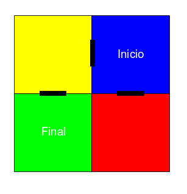
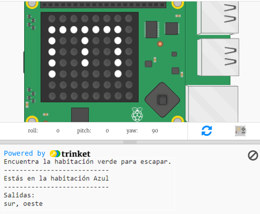
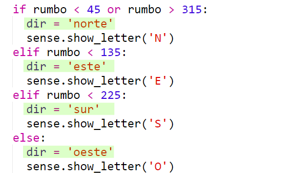
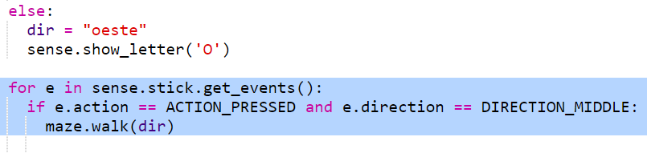

## Navegando por el laberinto

Ahora usemos la brújula para navegar por un laberinto.

Las habitaciones y puertas del Laberinto se muestran en este mapa:

Empiezas en la Habitación Azul y necesitas encontrar la Habitación Verde para escapar.

+ El código para crear un juego de aventura simple (como el del proyecto RPG) está en maze.py en tu proyecto.
    
    `maze.py` incluye algunas funciones para ayudarte a escribir un juego de laberinto:
    
    + `maze.start()` - comienza el juego
    + `maze.escaped()` - te dice si el jugador ha escapado del laberinto
    + `maze.walk(dir)` - mueve al jugador en la dirección indicada
    + `maze.getColour()` - te da el color de la habitación actual
    
    Necesitarás importar `maze.py`:
    
    

+ Comienza el juego con `maze.start()`:
    
    

+ Verás las instrucciones del juego que aparecen debajo del Sense HAT.
    
    

+ Para moverte por el laberinto necesitas usar `maze.walk(dir)` con la dirección en la que quieres moverte.
    
    Pon la dirección de la brújula actual en una variable `sudo`, necesitarás configurarla para cada dirección de la brújula:
    
    

+ Ahora hagamos que el jugador se mueva en la dirección que apunta la brújula del Sense HAT cuando presiona el botón central del joystick.
    
    

+ Intenta moverte por el laberinto usando la brújula.
    
    Para presionar el joystick, debes hacer clic en la ventana Sense HAT y luego presionar Enter en el teclado.

+ Prueba tu proyecto moviendo el Sense HAT en la dirección en la que quieres moverte y luego presiona Enter en el teclado.
    
    Mira el mapa si necesitas ayuda para encontrar la Habitación verde.

+ Cuando el jugador llega a la Habitación verde, ha logrado escapar del laberinto. Pongamos la pantalla en verde cuando ganen y terminen el juego:
    
    
    
    El `break` terminó el bucle para terminar la partida.