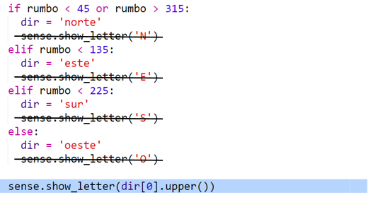
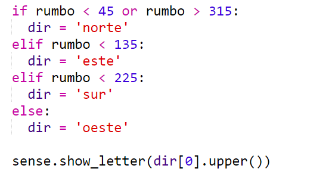

## Agregar colores

Sería mejor si pudieras saber en qué habitación estabas solo mirando el Sense HAT.

Vamos a mostrar la letra de la brújula en el color de la habitación actual.

Por ejemplo, si estás en la Habitación azul y mirando hacia el sur, deberías ver una letra S azul.

+ Necesitarás proporcionar un `text-colour` a `sense.show_letter`. En vez de hacerlo cuatro veces, cambia el código para usar la variable dir para decidir la letra que se mostrará en el Sense HAT.
    
    `dir[0].upper()` toma la primera letra de una cadena de caracteres y la convierte en mayúscula, así que "norte" te da 'N'.
    
    Cambia tu código de brújula para usar `show_letter` una vez:
    
    

+ Tu código de brújula debe parecerse a esto:
    
    

+ Ahora usa el color de la habitación actual cuando muestras la letra de la brújula:
    
    

+ Pon a prueba tu código y deberías notar que puedes saber en qué espacio estás a partir del color de la letra.
    
    