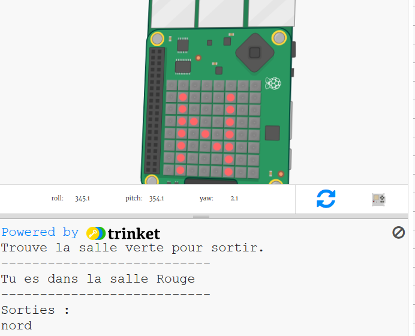

## Introduction :

Dans ce projet, tu utiliseras le Sense HAT comme une boussole pour naviguer dans un dédale de pièces colorées. Tu devras pointer le « Sense HAT » dans la direction dans laquelle tu souhaites te déplacer, puis appuyer sur le bouton au milieu du joystick pour faire un mouvement.

  <iframe src="https://trinket.io/embed/python/0c8cdacd70?outputOnly=true&start=result" width="600" height="500" frameborder="0" marginwidth="0" marginheight="0" allowfullscreen mark="crwd-mark">
</iframe> 

Pour jouer au jeu, appuie sur « Run » et lis le texte qui apparaît dans la fenêtre de sortie de la machine.

La direction actuelle de ton compas apparaîtra sur l'affichage du « Sense HAT » (N, S, E ou O.) Tu peux changer de direction en déplaçant le « Sense HAT » dans l'émulateur.

Lorsque tu fais face à la direction que tu souhaites suivre, appuies sur le bouton central du joystick en appuyant sur « Entrée » sur le clavier.

### Informations complémentaires pour les responsables de club

Si vous avez besoin d'imprimer ce projet, merci d'utiliser la [Version imprimable](https://projects.raspberrypi.org/fr-FR/projects/compass-maze/print).

--- collapse ---
---
title: Notes pour le responsable de club
---

## Introduction :

Dans ce projet, les enfants apprendront à utiliser le magnétomètre du « Sense HAT » (compas) et à utiliser la direction indiquée par la boussole pour naviguer dans un labyrinthe.

## Ressources en ligne

**Ce projet utilise Python 3.** Nous vous recommandons d'utiliser [Trinket](https://trinket.io/) pour écrire du code Python en ligne. Ce projet contient les Trinkets suivants :

* ['Un compas dans le labyrinthe' Début -- jumpto.cc/compass-go](http://jumpto.cc/compass-go)

Il existe aussi ce trinket qui contient le projet terminé :

* [‘Un compas dans le labyrinthe’ Terminé -- trinket.io/python/d11bf21615](https://trinket.io/python/d11bf21615)

## Ressources hors ligne

Ce projet peut également être [terminé hors-ligne](https://www.codeclubprojects.org/en-GB/resources/physical-sense-hat/) sur un ordinateur Raspberry Pi avec un Sense HAT. Vous pouvez accéder aux ressources du projet en cliquant sur le lien « Matériel pour projet ». Ce lien contient une section « Ressources du projet » qui inclut les ressources dont les enfants auront besoin pour compléter le projet hors ligne. Assurez-vous que les enfants ont accès à une copie de ces ressources. Cette section inclut les fichiers suivants :

* compass-maze/main.py
* compass-maze/maze.py

Vous pouvez aussi trouver une version terminée du projet dans la section « Ressources du bénévole » qui contient :

* compass-maze-finished/main.py
* compass-maze-finished/maze.py

(Toutes les ressources ci-dessus peuvent aussi être téléchargées dans les fichiers`.zip` projet et bénévole)

## Objectifs d'apprentissage

* Comment utiliser le magnétomètre du « Sense HAT » (`get_compass ()` )

Ce projet couvre les éléments suivants du [Programme de Créativité Numérique de Raspberry Pi](http://rpf.io/curriculum):

* [Combine des constructions de programmation pour résoudre un problème.](https://www.raspberrypi.org/curriculum/programming/builder)

## Défis

* « Récompense le joueur » - affichage d'une image sur les LED à la fin de la partie,;
* « Crée ton propre labyrinthe » - éditer le dictionnaire de labyrinthe pour créer leur propre labyrinthe.

--- /collapse ---

--- collapse ---
---
title: Matériel pour projet
---

## Ressources du projet

* [Fichier .zip contenant toutes les ressources du projet](resources/compass-maze-project-resources.zip)
* [Démarrage du projet « Une boussole dans le labyrinthe »](http://jumpto.cc/compass-go)
* [Fichier Python de démarrage hors ligne](resources/compass-maze-main.py)
* [Fichier Python de démarrage hors ligne contenant le code de labyrinthe](resources/compass-maze-maze.py)

## Ressources pour le responsable de club

* [Fichier .zip contenant toutes les ressources du projet](resources/compass-maze-volunteer-resources.zip)
* [Projet Trinket « Une boussole dans le labyrinthe » en ligne terminé](https://trinket.io/python/0c8cdacd70)
* [compass-maze-finished/main.py](resources/compass-maze-finished-main.py)
* [compass-maze-finished/maze.py](resources/compass-maze-finished-maze.py)

--- /collapse ---