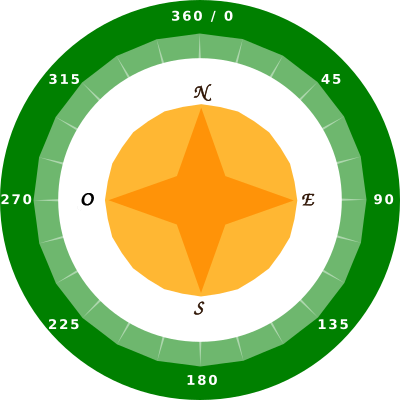
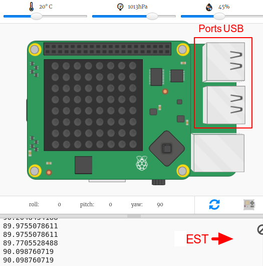
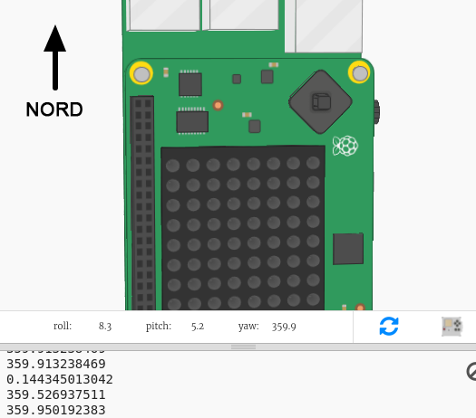

## Trouver la direction de la boussole

Le « Sense HAT » contient un magnétomètre qui peut être utilisé pour déterminer la direction du nord.

Dans l'émulateur, le Nord correspond au haut de ton écran. Le « Sense HAT » indique un cap compas en degrés par rapport au nord.

Voici un rappel des points d'un compas :

+ Ouvre le démarrage du projet « Une boussole dans le labyrinthe » dans Trinket : <a href="http://jumpto.cc/compass-go" target="_blank">jumpto.cc/compass-go</a>.

+ Voyons dans quelle direction le « Sense HAT » pointe. Ajoute le code suivant en bas de `main.py`:
    
    

+ Exécute ton code pour voir la direction indiquée par le compas - à combien de degrés tu es par rapport au nord.
    
    
    
    Dans sa position de départ, le « Sense HAT » fait face à l'est et tu devrais voir une valeur d'environ 90 degrés.
    
    La direction est basée sur les ports USB.

+ Fais glisser le Sense HAT pour changer sa direction.
    
    
    
    Essaye de trouver différentes directions :
    
    + Nord: environ 360 ou 0 degrés 
    + Est: environ 90 degrés
    + Sud: environ 180 degrés
    + Ouest: environ 270 degrés

+ Si tu t'embrouilles, tu peux toujours cliquer sur le bouton reset pour remettre le Sense HAT dans sa position de départ.
    
    