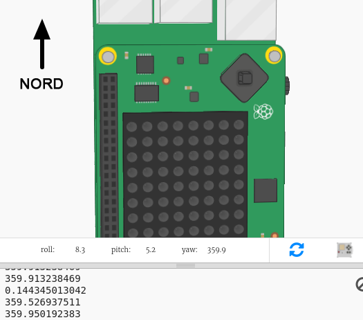
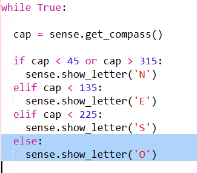

## Montrer la direction de la boussole

Ensuite montrons la direction de la boussole, N, E, S ou O, sur l'écran Sense HAT.

Si le compas indique entre 315 et 45, le « Sense HAT » pointe vers le nord et tu souhaites afficher un « N ». Si le compas indique entre 45 et 315, tu souhaites afficher un « E », etc.

+ D'abord, montrons un N à l'écran lorsque le Sense HAT fait face au nord.
    
    Rappelle-toi que lorsque le « Sense HAT » fait face au Nord, les ports USB sont en haut :
    
    

+ Change ton code pour afficher un « N » quand le cap du compas est compris entre 45 et 135 :
    
    

+ Fais glisser le « Sense HAT » vers le nord (ports USB en haut de l'écran) pour tester ton compas.
    
    

Le « N » ne disparaîtra pas, tu dois ajouter du code pour les autres directions.

+ Hmm, le « N » est de côté. Il serait plus logique que la lettre soit orientée dans la même direction que les ports USB.
    
    Ajoute le code suivant pour faire pivoter l'affichage du « Sense HAT ».
    
    
    
    Maintenant, la lettre de la boussole sera alignée avec les ports USB, ce qui est plus logique lorsque tu utilises le « Sense HAT » comme boussole.

+ D'abord, montrons un N à l'écran lorsque le Sense HAT fait face au nord. Si tu n'es pas face au nord, le cap doit être supérieur à 45 degrés, tu peux donc vérifier qu'il est inférieur à 315 degrés :
    
    

+ Ajoute le code pour le sud. Regarde le compas pour déterminer quelle doit être la condition.

+ Ton code devrait ressembler à ceci :
    
    

+ Ajoute maintenant le code pour l'ouest. Si ce n'est pas au nord, à l'est ou au sud, alors ça doit être à l'ouest ! Tu peux juste utiliser un 'else'.
    
    

+ Teste ton code en faisant tourner le « Sense HAT ».
    
    Tu as fait une boussole Sense HAT !