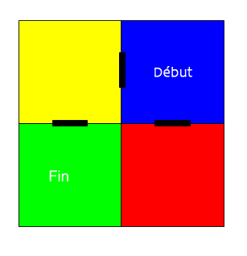

## Naviguer dans le labyrinthe

Maintenant, utilisons la boussole pour naviguer dans un labyrinthe.

Les pièces et les portes du labyrinthe sont comme indiquées sur cette carte:

Tu commences dans la salle bleue et tu dois trouver la salle verte pour t'échapper.

+ Le code pour créer un jeu d'aventure simple (comme celui du projet RPG) est dans maze.py dans ton projet.
    
    ` maze.py ` comprend quelques fonctions pour t'aider à écrire un jeu de labyrinthe:
    
    + ` maze.start () ` - démarre le jeu
    + ` maze.sorti () ` - t'indique si le joueur s'est échappé du labyrinthe
    + `maze.marche(dir)` - déplace le joueur dans la direction donnée
    + ` maze.getColour () ` - te donne la couleur de la pièce actuelle
    
    Tu devras importer `maze.py`:
    
    

+ Démarre le jeu avec ` maze.start () ` :
    
    

+ Tu verras les instructions du jeu apparaître sous le « Sense HAT ».
    
    

+ Pour te déplacer dans le labyrinthe, tu dois utiliser ` maze.marche (dir) ` avec la direction dans laquelle tu souhaites te déplacer.
    
    Mets la direction actuelle du compas dans une variable `dir`, tu devras la définir pour chaque direction de la boussole :
    
    

+ Maintenant, nous allons faire bouger le joueur dans la direction indiquée par la boussole « Sense HAT » lorsqu'il appuie sur le bouton central du joystick.
    
    

+ Essaye de te déplacer dans le labyrinthe à l'aide de la boussole.
    
    Pour appuyer sur le joystick, tu dois cliquer dans la fenêtre Sense HAT, puis appuyer sur Entrée (Retour) sur le clavier.

+ Teste ton projet en déplaçant le Sense HAT dans la direction dans laquelle tu veux avancer, puis en appuyant sur Entrée sur le clavier.
    
    Regarde la carte si tu as besoin d'aide pour trouver la chambre verte.

+ Quand le joueur atteint la salle verte, il a réussi à s'échapper du labyrinthe. Faison devenir l'écran vert quand il gagne et termine le jeu :
    
    
    
    Le `break` a terminé la boucle pour terminer la partie.