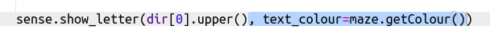

## Ajouter des couleurs

Ce serait mieux si tu pouvais dire dans quelle pièce tu étais juste en regardant le « Sense HAT ».

Affichons la lettre de la boussole dans la couleur de la salle actuelle.

Par exemple, si tu es dans la salle bleue et face au sud, tu devrais voir une lettre S bleue.

+ Tu devras fournir un `text-colour` à `sense.show_letter`. Plutôt que de le faire quatre fois, modifie le code pour utiliser la variable dir pour déterminer la lettre à afficher sur le Sense HAT.
    
    `dir[0].upper ()` prend la première lettre d'une chaîne et la transforme en une majuscule pour que « nord » te donne « N ».
    
    Change ton code de la boussole pour utiliser `show_letter` une seule fois :
    
    

+ Ton code devrait ressembler à ceci :
    
    

+ Utilise maintenant la couleur de la pièce actuelle lorsque tu affiches la lettre de la boussole:
    
    

+ Teste ton code et tu dois trouver que tu peux dire dans quelle pièce tu es à partir de la couleur de la lettre.
    
    