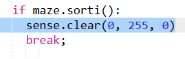

\--- challenge \---

## Défi: récompense le joueur

Peux-tu récompenser le joueur avec un affichage cool sur le « Sense HAT » quand il réussit à s'échapper?

Tu devras remplacer le code en surbrillance par ton propre code :

\--- /challenge \---