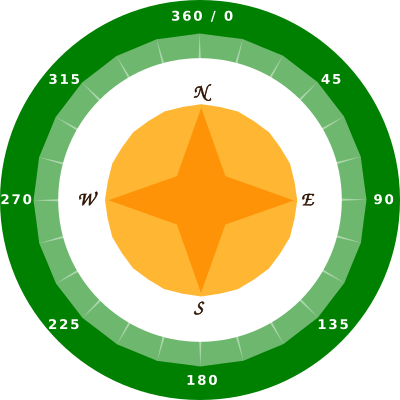
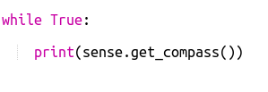

## कंपास की दिशा ढूँढना

Sense HAT में एक मैग्नेटोमीटर होता है जिसका उपयोग यह पता लगाने के लिए किया जा सकता है कि उत्तर दिशा किस तरफ है।

एम्यूलेटर में उत्तर दिशा आपकी स्क्रीन के शीर्ष से मेल खाती है। Sense HAT किसी कंपास की दिशा को उत्तर की ओर से डिग्री के रूप में बताता है।

यहाँ कंपास के बिंदु याद दिलाने के लिए दिए गए हैं:

+ Compass Maze Starter Trinket को खोलें: <a href="http://jumpto.cc/compass-go" target="_blank">jumpto.cc/compass-go</a>।

+ आइए जानें कि Sense HAT किस दिशा में इंगित कर रहा है। `main.py` के नीचे निम्नलिखित कोड को जोड़ें:
    
    

+ Run your code to see the compass heading - how many degrees you are from facing north.
    
    
    
    In its starting position the Sense HAT is facing east and you should see values of about 90 degrees.
    
    The direction is based on the USB ports.

+ Drag the Sense HAT around to change its direction.
    
    
    
    Try finding different directions:
    
    + North: Around 360 or 0 degrees 
    + East: Around 90 degrees
    + South: Around 180 degrees
    + West: Around 270 degrees

+ If you get in a muddle you can always click the reset button to put the Sense HAT back into its starting position.
    
    