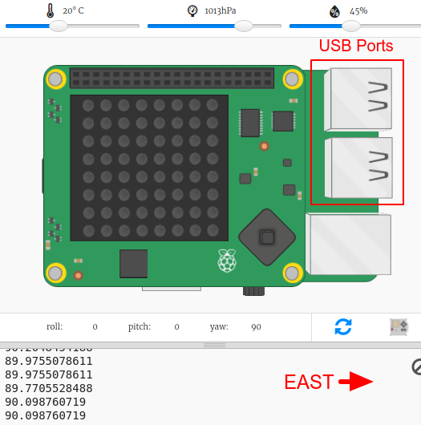

## कंपास की दिशा ढूँढना

Sense HAT में एक मैग्नेटोमीटर होता है जिसका उपयोग यह पता लगाने के लिए किया जा सकता है कि उत्तर दिशा किस तरफ है।

एम्यूलेटर में उत्तर दिशा आपकी स्क्रीन के शीर्ष से मेल खाती है। Sense HAT किसी कंपास की दिशा को उत्तर से डिग्री के रूप में बताता है।

यहाँ कंपास के बिंदु याद दिलाने के लिए दिए गए हैं:

+ Compass Maze स्टार्टर Trinket को खोलें: <a href="http://jumpto.cc/compass-go" target="_blank">jumpto.cc/compass-go</a>।

+ आइए हम जानें कि Sense HAT किस दिशा में इंगित कर रहा है। `main.py` के नीचे निम्नलिखित कोड को जोड़ें:
    
    

+ कंपास का शीर्षक देखने के लिए अपना कोड चलाएँ - उत्तर की ओर मुँह से आप कितनी डिग्री पर हैं।
    
    
    
    अपनी प्रारंभिक स्थिति में Sense HAT का मुँह पूर्व की ओर है और आपको लगभग 90 डिग्री के मान दिखाई देने चाहिए।
    
    दिशा USB पोर्ट पर आधारित होती है।

+ Sense HAT की दिशा बदलने के लिए उसे इधर-उधर खींचें।
    
    
    
    विभिन्न दिशाओं को खोजने का प्रयास करें:
    
    + उत्तर: लगभग 360 या 0 डिग्री 
    + पूर्व: लगभग 90 डिग्री
    + दक्षिण: लगभग 180 डिग्री
    + पश्चिम: लगभग 270 डिग्री

+ यदि आप उलझन में पड़ जाते हैं तो आप कभी भी Sense HAT को वापस स्टार्ट की स्थिति में लाने के लिए रीसेट बटन पर क्लिक कर सकते हैं।
    
    