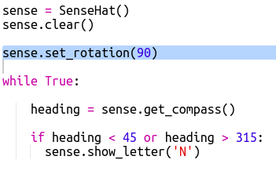

## कंपास की दिशा दिखाना

इसके बाद आइए हम आपको Sense HAT स्क्रीन पर, कंपास की N, E, S या W दिशा दिखाएँ।

यदि कंपास की हैडिंग डिग्री में 315 और 45 के बीच है तो Sense HAT उत्तर की ओर इंगित कर रहा है और आप 'N' प्रदर्शित करना चाहते हैं। यदि हैडिंग 45 और 315 के बीच है तो आप 'E' आदि प्रदर्शित करना चाहते हैं।

+ तो आइए पहले हम स्क्रीन पर N दिखाएँ जब Sense HAT का मुँह उत्तर की ओर हो।
    
    याद रखें कि जब जब Sense HAT का मुँह उत्तर की ओर होता है तो यूएसबी पोर्ट शीर्ष पर होते हैं:
    
    

+ कंपास हैडिंग जब 45 और 135 के बीच होने तो 'N' प्रदर्शित करने के लिए अपना कोड बदलें:
    
    

+ अपने कंपास का परीक्षण करने के लिए Sense Hat को उत्तर (यूएसबी पोर्ट स्क्रीन के शीर्ष पर) की ओर खींचें।
    
    

'N' गायब नहीं होगा, अन्य दिशाओं के लिए आपको कोड जोड़ने की आवश्यकता होगी।

+ हम्म, 'N' किनारे पर है। अक्षर को उसी दिशा की ओर रखना अधिक उचित होगा जिस दिशा में USB पोर्ट हैं।
    
    Sense HAT डिस्प्ले को घुमाने के लिए निम्न कोड जोड़ें।
    
    
    
    अब कंपास का अक्षर USB पोर्ट के साथ अलाइन किया हुआ होगा जो Sense HAT का उपयोग कंपास के रूप में करने की दृष्टि से अधिक उचित होगा।

+ आइए अब हम स्क्रीन पर E दिखाएँ जब Sense HAT का मुँह पूर्व की ओर हो। यदि आपका मुँह उत्तर की ओर नहीं है, तो हैडिंग 45 डिग्री से अधिक होना चाहिए ताकि आप जाँच कर सकें कि यह 315 से कम है:
    
    

+ दक्षिण के लिए कोड जोड़ें। यह देखने के लिए कंपास की ओर देखें कि क्या स्थिति होनी चाहिए।

+ आपका कोड इस प्रकार दिखना चाहिए:
    
    

+ अब पश्चिम के लिए कोड जोड़ें। यदि यह उत्तर, पूर्व या दक्षिण नहीं है तो यह पश्चिम होना चाहिए! आप बस 'अन्यथा' का उपयोग कर सकते हैं।
    
    

+ Sense HAT को इधर-उधर खींचकर अपने कोड का परीक्षण करें।
    
    आपने एक Sense HAT कंपास बनाया है!