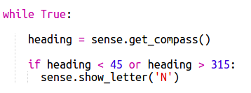

## कंपास की दिशा दिखाना

इसके बाद आइए हम आपको Sense HAT स्क्रीन पर, कंपास की N, E, S या W दिशा दिखाएँ।

यदि कंपास की हैडिंग डिग्री में 315 और 45 के बीच है तो Sense HAT उत्तर की ओर इंगित कर रहा है और आप 'N' प्रदर्शित करना चाहते हैं। यदि हैडिंग 45 और 315 के बीच है तो आप 'E' आदि प्रदर्शित करना चाहते हैं।

+ तो आइए पहले हम स्क्रीन पर N दिखाएँ जब Sense HAT का मुँह उत्तर की ओर हो।
    
    याद रखें कि जब जब Sense HAT का मुँह उत्तर की ओर होता है तो यूएसबी पोर्ट शीर्ष पर होते हैं:
    
    

+ कंपास हैडिंग जब 45 और 135 के बीच होने तो 'N' प्रदर्शित करने के लिए अपना कोड बदलें:
    
    

+ अपने कंपास का परीक्षण करने के लिए Sense Hat को उत्तर (यूएसबी पोर्ट स्क्रीन के शीर्ष पर) की ओर खींचें।
    
    

'N' गायब नहीं होगा, अन्य दिशाओं के लिए आपको कोड जोड़ने की आवश्यकता होगी।

+ हम्म, 'N' किनारे पर है। It would make more sense to have the letter facing in the same direction as the USB ports.
    
    Add the following code to rotate the Sense HAT display.
    
    
    
    Now the compass letter will be lined up with the USB ports which makes more sense when using the Sense HAT as a compass.

+ Now let's show an E on the screen when the Sense HAT is facing east. If you're not facing north then the heading must be more than 45 degrees so you can just check that it's less than 315:
    
    

+ Add the code for south. Look at the compass to work out what the condition needs to be.

+ Your code should look like this:
    
    

+ Now add the code for west. If it's not north, east or south then it must be west! You can just use an 'else'.
    
    

+ Test your code by dragging the Sense HAT around.
    
    You've made a Sense HAT compass!