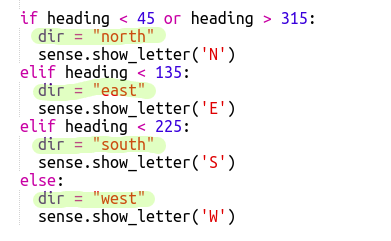

## Navigating the maze

आइए अब किसी भूलभुलैया के इर्द-गिर्द नेविगेट करने के लिए कंपास का उपयोग करें।

भूलभुलैया में कमरे और दरवाजे इस नक्शे में दिखाए गए अनुसार हैं:

आप नीले कमरे में शुरू करते हैं और वहाँ से निकलने के लिए आपको हरा कमरा ढूँढना होता है।

+ एक साधारण साहसिक गेम (जैसी RPG प्रोजेक्ट में होती है) बनाने के लिए कोड आपकी प्रोजेक्ट में maze.py में है।
    
    `maze.py` में कुछ फंक्शन होते हैं जो आपको भूलभुलैया गेम लिखने में मदद करते हैं:
    
    + `maze.start()` - गेम को शुरू करता है
    + `maze.escaped()` - आपको बताता है कि खिलाड़ी भूलभुलैया से निकल पाया है या नहीं
    + `maze.walk(dir)` - खिलाड़ी को दी गई दिशा में ले जाता है
    + `maze.getColour()` - आपको वर्तमान कमरे का रंग देता है
    
    आपको `maze.py` आयात करने की आवश्यकता होगी:
    
    

+ गेम `maze.start()` से शुरू करें:
    
    

+ You'll see the game instructions appear below the Sense HAT.
    
    

+ To move around the maze you need to use `maze.walk(dir)` with the direction you want to move in.
    
    Put the current compass direction in a `dir` variable, you'll need to set it for each compass direction:
    
    

+ Now let's have the player move in the direction the Sense HAT compass is pointing when they press the middle button on the joystick.
    
    

+ Try moving around the maze using the compass.
    
    To press the joystick you need to click in the Sense HAT window and then press Enter (Return) on the keyboard.

+ Test your project by moving the Sense HAT to the direction you want to move in and then tapping Enter on the keyboard.
    
    Look at the map if you need help to find the Green room.

+ When the player reaches the Green room they have managed to escape the maze. Let's turn the screen green when they win and end the game:
    
    
    
    The `break` finished the loop to end the game.