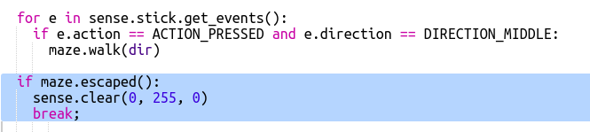

## भूलभुलैया में चलना

आइए अब भूलभुलैया के इर्द-गिर्द चलने के लिए कम्पास का उपयोग करें।

भूलभुलैया में कमरे और दरवाजे इस नक्शे में दिखाए गए हैं:

आप नीले कमरे में शुरू करते हैं और वहाँ से निकलने के लिए आपको हरा कमरा ढूँढना होता है।

+ एक साधारण साहसिक गेम बनाने के लिए कोड (जिस तरह RPG प्रोजेक्ट में है) आपकी प्रोजेक्ट में maze.py में है।
    
    `maze.py` में कुछ फंक्शन हैं जो आपको भूलभुलैया गेम लिखने में मदद करेंगे:
    
    + `maze.start()` - गेम को शुरू करता है
    + `maze.escaped()` - आपको बताता है कि खिलाड़ी भूलभुलैया से निकल पाया है या नहीं
    + `maze.walk(dir)` - खिलाड़ी को दी गई दिशा में ले जाता है
    + `maze.getColour()` - आपको वर्तमान कमरे का रंग बताता है
    
    आपको `maze.py` आयात करना होगा:
    
    

+ गेम `maze.start()` से स्टार्ट करें:
    
    

+ गेम के निर्देश आपको Sense HAT के नीचे दिखाई देंगे।
    
    

+ भूलभुलैया के इर्द-गिर्द जाने के लिए आप जिस दिशा में जाना चाहते हैं उसके साथ आपको `maze.walk(dir)` का उपयोग करना होगा।
    
    वर्तमान कम्पास दिशा को `dir` वेरिएबल में रखें, आपको इसे प्रत्येक कंपास दिशा के लिए सेट करना होगा:
    
    

+ आइए अब हम खिलाड़ी को उस दिशा में चलने दें जिस दिशा में Sense HAT कम्पास तब इंगित करता है जब वे जॉयस्टिक पर बीच का बटन दबाते हैं।
    
    

+ कम्पास का उपयोग करके भूलभुलैया के इर्द-गिर्द चलने का प्रयास करें।
    
    जॉयस्टिक को दबाने के लिए आपको Sense HAT विंडो में क्लिक करना होगा और फिर कीबोर्ड पर एंटर (रिटर्न) कुंजी को दबाना होगा।

+ अपने प्रोजेक्ट का परीक्षण करने के लिए Sense HAT को उस दिशा में ले जाएँ जिसमें आप जाना चाहते हैं और फिर कीबोर्ड पर Enter कुंजी दबाएँ।
    
    यदि आपको हरे कमरे को खोजने में मदद चाहिए हो तो नक्शा देखें।

+ जब खिलाड़ी हरे कमरे में पहुँच जाता है तो इसका मतलब है कि वह भूलभुलैया से निकलने में कामयाब हो गया है। तो आइए हम खिलाड़ी के जीत जाने पर स्क्रीन को हरा कर दें और गेम को समाप्त कर दें:
    
    
    
    गेम को समाप्त करने के लिए `break` लूप को समाप्त कर देता है।