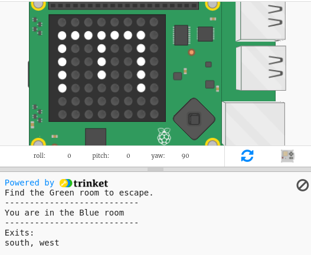

## Navigating the maze

Now let's use the compass to navigate around a maze.

The rooms and doors in the Maze are as shown in this map:

You start in the Blue room and need to find the Green room to escape.

+ The code for creating a simple adventure game (like the one in the RPG project) is in maze.py in your project.
    
    `maze.py` includes some functions to help you write a maze game:
    
    + `maze.start()` - starts the game
    + `maze.escaped()` - tells you whether the player has escaped the maze
    + `maze.walk(dir)` - moves the player in the given direction
    + `maze.getColour()` - gives you the colour of the current room
    
    You'll need to import `maze.py`:
    
    

+ Start the game with `maze.start()`:
    
    

+ You'll see the game instructions appear below the Sense HAT.
    
    

+ To move around the maze you need to use `maze.walk(dir)` with the direction you want to move in.
    
    Put the current compass direction in a `dir` variable, you'll need to set it for each compass direction:
    
    

+ Now let's have the player move in the direction the Sense HAT compass is pointing when they press the middle button on the joystick.
    
    

+ Try moving around the maze using the compass.
    
    To press the joystick you need to click in the Sense HAT window and then press Enter (Return) on the keyboard.

+ Test your project by moving the Sense HAT to the direction you want to move in and then tapping Enter on the keyboard.
    
    Look at the map if you need help to find the Green room.

+ When the player reaches the Green room they have managed to escape the maze. Let's turn the screen green when they win and end the game:
    
    
    
    The `break` finished the loop to end the game.