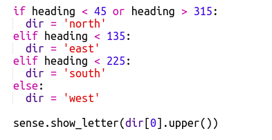

## Add colours

It would be better if you could tell which room you were in just by looking at the Sense HAT.

Let's display the compass letter in the colour of the current room.

For example, if you're in the Blue room and facing South you should see a blue letter S.

+ You'll need to provide a `text-colour` to `sense.show_letter`. Rather than do that four times, change the code to use the dir variable to work out the letter to show on the Sense HAT.
    
    `dir[0].upper()` takes the first letter of a string and turns it into a capital so "north" gives you 'N'.
    
    Change your compass code to use `show_letter` once:
    
    

+ आपका कंपास कोड अब इस प्रकार दिखना चाहिए:
    
    

+ Now use the colour of the current room when you display the compass letter:
    
    

+ Test your code and you should find that you can tell which room you're in from the colour of the letter.
    
    