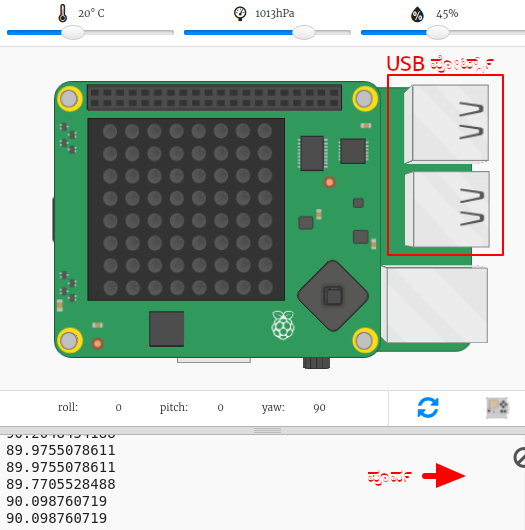
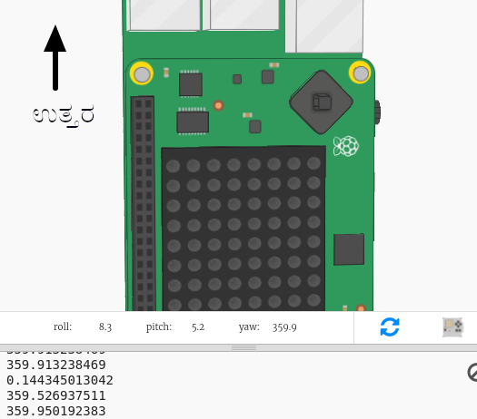

## ದಿಕ್ಸೂಚಿಯ ದಿಕ್ಕುಗಳನ್ನು ಕಂಡುಹಿಡಿಯುವುದು

ಸೆನ್ಸ್ ಹ್ಯಾಟ್ ಮ್ಯಾಗ್ನೆಟೋಮೀಟರ್ ಅನ್ನು ಹೊಂದಿದ್ದು, ಅದನ್ನು ಯಾವುದು ಉತ್ತರ ದಿಕ್ಕು ಎಂದು ಕಂಡುಹಿಡಿಯಲು ಬಳಸಬಹುದು.

ಎಮ್ಯುಲೇಟರ್ನಲ್ಲಿ ಉತ್ತರ ದಿಕ್ಕು ನಿಮ್ಮ ಪರದೆಯ ಮೇಲ್ಭಾಗದಲ್ಲಿ ಇರುತ್ತದೆ. Sense HAT ಉತ್ತರದಿಂದ ದಿಕ್ಸೂಚಿ ಹೋಗುತ್ತಿದೆ ಎಂದು ಡಿಗ್ರಿಗಳಲ್ಲಿ ವರದಿ ಮಾಡುತ್ತದೆ.

ದಿಕ್ಸೂಚಿ ಬಗ್ಗೆ ಜ್ಞಾಪಕದಲ್ಲಿ ಇಟ್ಟುಕೊಳ್ಳಬೇಕಾದ ಕೆಲವು ಅಂಶಗಳು ಇಲ್ಲಿವೆ:

+ ಕಂಪಾಸ್ ಮೇಜ್ ಸ್ಟಾರ್ಟರ್ Trinket ತೆರೆಯಿರಿ: <a href="http://jumpto.cc/compass-go" target="_blank">jumpto.cc/compass-go</a>.

+ Sense HAT ಯಾವ ದಿಕ್ಕಿನಲ್ಲಿ ತೋರಿಸುತ್ತಿದೆ ಎಂಬುದನ್ನು ಕಂಡುಹಿಡಿಯೋಣ. ಈ ಕೆಳಗಿನ ಕೋಡ್ ಅನ್ನು `main.py` ನ ಕೆಳಭಾಗಕ್ಕೆ ಸೇರಿಸಿ:
    
    

+ ದಿಕ್ಸೂಚಿಯ ಶಿರವನ್ನು ನೋಡಲು ಕೋಡ್ ಅನ್ನು Run ಮಾಡಿ-ನೀವು ಎಷ್ಟು ಡಿಗ್ರಿ ಉತ್ತರಕ್ಕೆ ಮುಖ ಮಾಡಿದ್ದೀರಾ.
    
    
    
    ಅದರ ಆರಂಭಿಕ ಸ್ಥಾನದಲ್ಲಿ Sense HAT ಪೂರ್ವಕ್ಕೆ ಮುಖ ಮಾಡಿರುತ್ತದೆ ಮತ್ತು ನೀವು ಸುಮಾರು 90 ಡಿಗ್ರಿ ಮೌಲ್ಯಗಳನ್ನು ನೋಡಬೇಕು.
    
    ದಿಕ್ಕುಗಳು ಯುಎಸ್‌ಬಿ ಪೋರ್ಟ್‌ಗಳನ್ನು ಆಧರಿಸಿದೆ.

+ ಅದರ ದಿಕ್ಕನ್ನು ಬದಲಾಯಿಸಲು Sense HAT ಅನ್ನು ಎಳೆಯಿರಿ.
    
    
    
    ವಿಭಿನ್ನ ದಿಕ್ಕುಗಳನ್ನು ಕಂಡುಹಿಡಿಯಲು ಪ್ರಯತ್ನಿಸಿ:
    
    + ಉತ್ತರ: ಸುಮಾರು 360 ಅಥವಾ 0 ಡಿಗ್ರಿ 
    + ಪೂರ್ವ: ಸುಮಾರು 90 ಡಿಗ್ರಿ
    + ದಕ್ಷಿಣ: ಸುಮಾರು 180 ಡಿಗ್ರಿ
    + ಪಶ್ಚಿಮ: ಸುಮಾರು 270 ಡಿಗ್ರಿ

+ ನೀವು ಗೊಂದಲದಲ್ಲಿದ್ದರೆ Sense HAT ಅನ್ನು ಅದರ ಆರಂಭಿಕ ಸ್ಥಾನಕ್ಕೆ ತರಲು ನೀವು ಯಾವಾಗಲಾದರೂ ರಿಸೆಟ್ ಬಟನ್ ಅನ್ನು ಕ್ಲಿಕ್ ಮಾಡಬಹುದು.
    
    