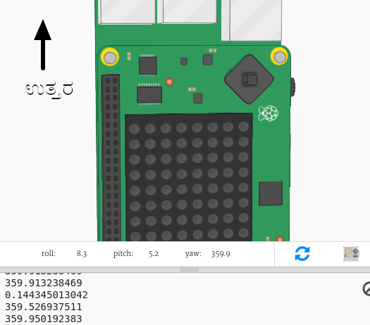

## ದಿಕ್ಸೂಚಿಯ ದಿಕ್ಕುಗಳನ್ನು ತೋರಿಸುವುದು

ಮುಂದೆ Sense HAT ಪರದೆಯಲ್ಲಿ ದಿಕ್ಸೂಚಿಯ ದಿಕ್ಕುಗಳು, N, E, S ಅಥವಾ W ಅನ್ನು ತೋರಿಸೋಣ.

ಡಿಗ್ರಿಗಳಲ್ಲಿ ದಿಕ್ಸೂಚಿಯ ಹೆಡಿಂಗ್ 315 ಮತ್ತು 45 ರ ನಡುವೆ ಇದ್ದರೆ, Sense HAT ಉತ್ತರ ದಿಕ್ಕನ್ನು ಸೂಚಿಸುತ್ತದೆ ಮತ್ತು ನೀವು 'N' ಅನ್ನು ಡಿಸ್ಪ್ಲೇ ಮಾಡಲು ಬಯಸುತ್ತೀರಿ. ಹೆಡಿಂಗ್ 45 ಮತ್ತು 315 ರ ನಡುವೆ ಇದ್ದರೆ ನೀವು 'E' ಅನ್ನು ಡಿಸ್ಪ್ಲೇ ಮಾಡಲು ಬಯಸುತ್ತೀರಿ.

+ ಮೊದಲು Sense HAT ಉತ್ತರಕ್ಕೆ ಮುಖ ಮಾಡಿದಾಗ ಡಿಸ್ಪ್ಲೇ ಮೇಲೆ N ಅನ್ನು ತೋರಿಸೋಣ.
    
    Sense HAT ಉತ್ತರಕ್ಕೆ ಮುಖ ಮಾಡಿದಾಗ ಯುಎಸ್‌ಬಿ ಪೋರ್ಟ್‌ಗಳು ಮೇಲ್ಭಾಗದಲ್ಲಿರುತ್ತದೆ ಎಂಬುದನ್ನು ನೆನಪಿಡಿ:
    
    

+ ದಿಕ್ಸೂಚಿಯ ಹೆಡಿಂಗ್ 45 ಮತ್ತು 135 ರ ನಡುವೆ ಇರುವಾಗ 'N' ಅನ್ನು ಡಿಸ್ಪ್ಲೇ ಮಾಡಲು ನಿಮ್ಮ ಕೋಡ್ ಅನ್ನು ಬದಲಾಯಿಸಿ:
    
    

+ ನಿಮ್ಮ ದಿಕ್ಸೂಚಿಯನ್ನು ಪರೀಕ್ಷಿಸಲು Sense HAT ಅನ್ನು ಉತ್ತರಕ್ಕೆ(ಪರದೆಯ ಮೇಲ್ಭಾಗದಲ್ಲಿರುವ ಯುಎಸ್‌ಬಿ ಪೋರ್ಟ್‌ಗಳು) ಎಳೆಯಿರಿ.
    
    

'N' ಕಣ್ಮರೆಯಾಗುವುದಿಲ್ಲ, ನೀವು ಇತರ ದಿಕ್ಕುಗಳಿಗಾಗಿ ಕೋಡ್ ಅನ್ನು ಸೇರಿಸುವ ಅಗತ್ಯವಿದೆ.

+ ಹಾಂ, 'N' ಪಕ್ಕದಲ್ಲಿದೆ. ಅಕ್ಷರವು ಯುಎಸ್‌ಬಿ ಪೋರ್ಟ್‌ಗಳ ದಿಕ್ಕಿನಲ್ಲಿರುವುದು ಹೆಚ್ಚು ಅರ್ಥಪೂರ್ಣವಾಗಿದೆ.
    
    Sense HAT ಡಿಸ್ಪ್ಲೇ ಅನ್ನು ತಿರುಗಿಸಲು ಕೆಳಗಿನ ಕೋಡ್ ಸೇರಿಸಿ.
    
    
    
    ಈಗ ದಿಕ್ಸೂಚಿಯ ಅಕ್ಷರವನ್ನು ಯುಎಸ್‌ಬಿ ಪೋರ್ಟ್‌ಗಳೊಂದಿಗೆ ಜೋಡಿಸಲಾಗುವುದು, ಇದು Sense HAT ಅನ್ನು ದಿಕ್ಸೂಚಿಯಾಗಿ ಬಳಸುವಾಗ ಹೆಚ್ಚು ಅರ್ಥವನ್ನು ನೀಡುತ್ತದೆ.

+ ಈಗ Sense HAT ಪೂರ್ವಕ್ಕೆ ಮುಖ ಮಾಡಿದಾಗ ಪರದೆಯ ಮೇಲೆ E ಅನ್ನು ತೋರಿಸೋಣ. ನೀವು ಉತ್ತರದತ್ತ ಮುಖ ಮಾಡದಿದ್ದರೆ ಹೆಡಿಂಗ್ 45 ಡಿಗ್ರಿಗಳಿಗಿಂತ ಹೆಚ್ಚಿರಬೇಕು ಆದ್ದರಿಂದ ಅದು 315 ಕ್ಕಿಂತ ಕಡಿಮೆ ಇದೆಯೇ ಎಂದು ನೀವು ಪರಿಶೀಲಿಸಬಹುದು:
    
    

+ ದಕ್ಷಿಣಕ್ಕೆ ಕೋಡ್ ಸೇರಿಸಿ. ಸ್ಥಿತಿ ಏನಾಗಿರಬೇಕು ಎಂದು ಕಂಡುಹಿಡಿಯಲು ದಿಕ್ಸೂಚಿಯನ್ನು ನೋಡಿ.

+ ನಿಮ್ಮ ಕೋಡ್ ಈ ರೀತಿ ಇರಬೇಕು:
    
    

+ ಈಗ ಪಶ್ಚಿಮಕ್ಕೆ ಕೋಡ್ ಸೇರಿಸಿ. ಅದು ಉತ್ತರ, ಪೂರ್ವ ಅಥವಾ ದಕ್ಷಿಣವಲ್ಲದಿದ್ದರೆ ಅದು ಪಶ್ಚಿಮವಾಗಿರಬೇಕು! ನೀವು 'else' ಅನ್ನು ಬಳಸಬಹುದು.
    
    

+ Sense HAT ಅನ್ನು ಎಳೆಯುವ ಮೂಲಕ ನಿಮ್ಮ ಕೋಡ್ ಅನ್ನು ಪರೀಕ್ಷಿಸಿ.
    
    ನೀವು Sense HAT ದಿಕ್ಸೂಚಿಯನ್ನು ತಯಾರಿಸಿದ್ದಿರಿ!