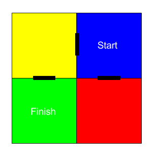

## ಮೇಜ್ ಅನ್ನು ನ್ಯಾವಿಗೇಟ್ ಮಾಡುವುದು

ಈಗ ಮೇಜ್ ನಿಂದ ನ್ಯಾವಿಗೇಟ್ ಮಾಡಲು ದಿಕ್ಸೂಚಿ ಅನ್ನು ಬಳಸೋಣ.

ಈ ನಕ್ಷೆಯಲ್ಲಿ ತೋರಿಸಿರುವಂತೆ ಮೇಜ್‌ನಲ್ಲಿರುವ ಕೊಠಡಿಗಳು ಮತ್ತು ಬಾಗಿಲುಗಳು ಇವೆ:

ನೀವು ನೀಲಿ ಕೋಣೆ ಇಂದ ಪ್ರಾರಂಭಿಸಿ ತಪ್ಪಿಸಿಕೊಳ್ಳಲು ಹಸಿರು ಕೋಣೆಯನ್ನು ಕಂಡುಹಿಡಿಯಬೇಕು.

+ ಸರಳ ಸಾಹಸ ಆಟವನ್ನು(RPG ಪ್ರಾಜೆಕ್ಟ್‌ನಲ್ಲಿರುವಂತೆ) ರಚಿಸುವ ಕೋಡ್ ನಿಮ್ಮ ಪ್ರಾಜೆಕ್ಟ್‌ನಲ್ಲಿ maze.py ನಲ್ಲಿದೆ.
    
    ಮೇಜ್ ಆಟವನ್ನು ರಚಿಸಲು ನಿಮಗೆ ಸಹಾಯ ಮಾಡಲು `maze.py` ಕೆಲವು ಫುನ್ಕ್ಷನ್ನ್ ಗಳನ್ನು ಒಳಗೊಂಡಿದೆ:
    
    + `maze.start()` - ಆಟವನ್ನು ಪ್ರಾರಂಭಿಸುತ್ತದೆ
    + `maze.escaped()` - ಆಟಗಾರನು ಮೇಜ್ನಿಂದ ತಪ್ಪಿಸಿಕೊಂಡಿದ್ದಾನೆಯೇ ಎಂದು ನಿಮಗೆ ತಿಳಿಸುತ್ತದೆ
    + `maze.walk(dir)` - ನಿರ್ದಿಷ್ಟ ದಿಕ್ಕಿನಲ್ಲಿ ಆಟಗಾರನನ್ನು ಚಲಿಸುತ್ತದೆ
    + `maze.getColour()` - ಪ್ರಸ್ತುತ ಕೋಣೆಯ ಬಣ್ಣವನ್ನು ನಿಮಗೆ ನೀಡುತ್ತದೆ
    
    ನೀವು `maze.py` ಅನ್ನು ಇಂಪೋರ್ಟ್ ಮಾಡಬೇಕಾಗುತ್ತದೆ:
    
    

+ `maze.start ()` ನೊಂದಿಗೆ ಆಟವನ್ನು ಪ್ರಾರಂಭಿಸಿ:
    
    

+ Sense HATನ ಕೆಳಗೆ ಆಟದ ಸೂಚನೆಗಳು ಗೋಚರಿಸುವುದನ್ನು ನೀವು ನೋಡುತ್ತೀರಿ.
    
    

+ ಮೇಜ್ ಸುತ್ತಲು ನೀವು ಚಲಿಸಲು ಬಯಸುವ ದಿಕ್ಕಿನೊಂದಿಗೆ `maze.walk(dir)` ಅನ್ನು ಬಳಸಬೇಕಾಗುತ್ತದೆ.
    
    ಪ್ರಸ್ತುತ ದಿಕ್ಸೂಚಿಯ ದಿಕ್ಕನ್ನು `dir`ವೇರಿಯಬಲ್ ನಲ್ಲಿ ಇರಿಸೀ, ನೀವು ಪ್ರತಿ ದಿಕ್ಸೂಚಿ ನ ದಿಕ್ಕಿಗೆ ಇದನ್ನು ಹೊಂದಿಸಬೇಕಾಗುತ್ತದೆ:
    
    

+ ಈಗ ಆಟಗಾರನು ಜಾಯ್‌ಸ್ಟಿಕ್‌ನ ಮಧ್ಯದ ಬಟನ್ಅನ್ನು ಒತ್ತಿದಾಗ Sense HAT ದಿಕ್ಸೂಚಿ ಸೂಚಿಸುವ ದಿಕ್ಕಿನಲ್ಲಿ ಅವರನ್ನು ಚಲಿಸೋಣ.
    
    

+ ದಿಕ್ಸೂಚಿ ಬಳಸಿ ಮೇಜ್ಅನ್ನು ಸುತ್ತಲು ಪ್ರಯತ್ನಿಸಿ.
    
    ಜಾಯ್‌ಸ್ಟಿಕ್ ಅನ್ನು ಒತ್ತಲು ನೀವು Sense HAT ವಿಂಡೋದಲ್ಲಿ ಕ್ಲಿಕ್ ಮಾಡಿ ನಂತರ ಕೀಬೋರ್ಡ್‌ನಲ್ಲಿ ಎಂಟರ್ (ರಿಟರ್ನ್) ಒತ್ತಿರಿ.

+ ನೀವು ಚಲಿಸಲು ಬಯಸುವ ದಿಕ್ಕಿಗೆ Sense HAT ಅನ್ನು ಸರಿಸಿ ನಂತರ ಕೀಬೋರ್ಡ್‌ನಲ್ಲಿ ಎಂಟರ್ ಟ್ಯಾಪ್ ಮಾಡುವ ಮೂಲಕ ನಿಮ್ಮ ಪ್ರಾಜೆಕ್ಟ್ಅನ್ನು ಪರೀಕ್ಷಿಸಿ.
    
    ಹಸಿರು ಕೋಣೆಯನ್ನು ಹುಡುಕಲು ನಿಮಗೆ ಸಹಾಯ ಬೇಕಾದರೆ ನಕ್ಷೆಯನ್ನು ನೋಡಿ.

+ ಆಟಗಾರನು ಹಸಿರು ಕೋಣೆಯನ್ನು ತಲುಪಿದಾಗ ಅವರು ಮೇಜ್ ನಿಂದ ತಪ್ಪಿಸಿಕೊಳ್ಳುವಲ್ಲಿ ಯಶಸ್ವಿಯಾಗಿದ್ದಾರೆ. ಅವರು ಪಂದ್ಯವನ್ನು ಗೆದ್ದಾಗ ಪರದೆಯಮೇಲೆ ಹಸಿರು ಬಣ್ಣ ತೋರಿಸೋಣ ಮತ್ತು ಪಂದ್ಯವನ್ನುಅಂತ್ಯಗೊಳಿಸೋಣ:
    
    
    
    `break` ಆಟವನ್ನು ಕೊನೆಗೊಳಿಸಲು ಲೂಪ್ ಅನ್ನು ಮುಗಿಸಿದೆ.