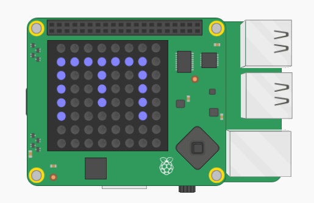

## ಬಣ್ಣಗಳನ್ನು ಸೇರಿಸಿ

Sense HAT ಅನ್ನು ನೋಡುವ ಮೂಲಕ ನೀವು ಯಾವ ಕೋಣೆಯಲ್ಲಿದ್ದೀರಿ ಎಂದು ಹೇಳಲು ಸಾಧ್ಯವಾದರೆ ಉತ್ತಮ.

ಪ್ರಸ್ತುತ ಕೋಣೆಯ ಬಣ್ಣದಲ್ಲಿ ದಿಕ್ಸೂಚಿಯ ಅಕ್ಷರವನ್ನು ಪ್ರದರ್ಶಿಸೋಣ.

ಉದಾಹರಣೆಗೆ, ನೀವು ನೀಲಿ ಕೋಣೆಯಲ್ಲಿದ್ದರೆ ಮತ್ತು ದಕ್ಷಿಣಕ್ಕೆ ಮುಖ ಮಾಡುತ್ತಿದ್ದರೆ ನಿಮಗೆ S ಅಕ್ಷರವು ನೀಲಿಬಣ್ಣದಲ್ಲಿ ಕಾಣಬೇಕು.

+ ನೀವು `sense.show_letter` ಗೆ `ಟೆಕ್ಸ್ಟ್-ಕಲರ್` ಅನ್ನು ಒದಗಿಸುವ ಅಗತ್ಯವಿದೆ. ಅದನ್ನು ನಾಲ್ಕು ಬಾರಿ ಮಾಡುವ ಬದಲು, Sense HAT‌ನಲ್ಲಿ ತೋರಿಸಲು ಅಕ್ಷರವನ್ನು ವರ್ಕ್ ಮಾಡಲು dir ವೇರಿಯಬಲ್ ಅನ್ನು ಬಳಸಲು ಕೋಡ್ ಬದಲಾಯಿಸಿ.
    
    `dir[0].upper()` ಸ್ಟ್ರಿಂಗ್‌ನ ಮೊದಲ ಅಕ್ಷರವನ್ನು ತೆಗೆದುಕೊಂಡು ಅದನ್ನು ಕ್ಯಾಪಿಟಲ್ ಲೆಟರ್ ಆಗಿ ಪರಿವರ್ತಿಸುತ್ತದೆ ಆದ್ದರಿಂದ "ಉತ್ತರ(North)" ನಿಮಗೆ 'N'ಅನ್ನು ನೀಡುತ್ತದೆ.
    
    `show_letter` ಅನ್ನು ಬಳಸಲು ನಿಮ್ಮ ದಿಕ್ಸೂಚಿಯ ಕೋಡ್ ಅನ್ನು ಒಮ್ಮೆ ಬದಲಾಯಿಸಿ:
    
    

+ ನಿಮ್ಮ ದಿಕ್ಸೂಚಿಯ ಕೋಡ್ ಈ ರೀತಿ ಇರಬೇಕು:
    
    

+ ನೀವು ದಿಕ್ಸೂಚಿ ಅಕ್ಷರವನ್ನು ಡಿಸ್ಪ್ಲೇ ಮಾಡವಾಗ ಪ್ರಸ್ತುತ ಕೋಣೆಯ ಬಣ್ಣವನ್ನು ಬಳಸಿ:
    
    

+ ನಿಮ್ಮ ಕೋಡ್ ಅನ್ನು ಪರೀಕ್ಷಿಸಿ ಮತ್ತು ಅಕ್ಷರದ ಬಣ್ಣದಿಂದ ನೀವು ಯಾವ ಕೋಣೆಯಲ್ಲಿದ್ದೀರಿ ಎಂದು ನೀವು ಹೇಳಬಹುದು.
    
    