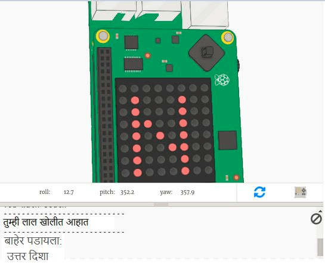

## परिचय:

या प्रोजेक्टमध्ये तुम्ही रंगीबेरंगी खोल्यांच्या चक्रव्यूह बाहेर नेव्हिगेट करण्यासाठी होकायंत्र (कंपास) म्हणून Sense HAT चा वापर कराल. तुम्ही हलवू इच्छित असलेल्या दिशेने तुमचा Sense HAT दर्शविणे आवश्यक आहे आणि पुढे जाण्यासाठी जॉयस्टिकच्या मध्यभागी असलेले बटण दाबा.

  <iframe src="https://trinket.io/embed/python/0c8cdacd70?outputOnly=true&start=result" width="600" height="500" frameborder="0" marginwidth="0" marginheight="0" allowfullscreen mark="crwd-mark">
</iframe> 

खेळ खेळण्यासाठी Run दाबा आणि trinket output विंडोमध्ये दिसणारा मजकूर वाचा.

तुमची वर्तमान होकायंत्र दिशा Sense HAT display वर दिसेल (N, S, E किंवा W.) तुम्ही एमुलेटरमध्ये Sense HAT हलवून दिशा बदलू शकता.

जेव्हा तुम्ही ज्या दिशेने जाऊ इच्छित आहात त्या दिशेने तोंड करून उभे असाल, कीबोर्डवरील एन्टर दाबून जॉयस्टिकच्या मध्यभागी असलेले बटण दाबा.

### क्लब प्रमुखांसाठी अधिक माहिती

तुम्हाला हा प्रकल्प प्रिंट करण्याची आवश्यकता असल्यास, कृपया [प्रिंट अनुकूल आवृत्ती](https://projects.raspberrypi.org/mr-IN/projects/compass-maze/print) वापरा.

--- collapse ---
---
title: क्लब प्रमुखांसाठी नोंद
---

## परिचय:

या प्रोजेक्टमध्ये, मुले Sense HAT मॅग्नेटोमीटर (होकायंत्र) कसे वापरावे हे शिकतील आणि चक्रव्यूहमधून नॅव्हिगेट करण्यासाठी होकायंत्र दिशा वापरतील.

## ऑनलाईन संसाधने

हा प्रोजेक्ट **Python 3** चा वापर करतो. Python (पायथन) ऑनलाईन लिहिण्यासाठी आम्ही [Trinket](https://trinket.io/) वापरण्याचा सल्ला देतो. ह्या प्रोजेक्ट मध्ये खालील Trinkets आहेत:

* ['होकायंत्र चक्रव्यूह' Starter Trinket -- jumpto.cc/compass-go](http://jumpto.cc/compass-go)

येथे पूर्ण झालेले प्रोजेक्ट असलेले एक trinket देखील आहे:

* [‘होकायंत्र चक्रव्यूह’ Finished -- trinket.io/python/d11bf21615](https://trinket.io/python/d11bf21615)

## ऑफलाइन संसाधने

हा प्रोजेक्ट Raspberry Pi संगणकावर Sense HAT सह [ऑफलाइन](https://www.codeclubprojects.org/en-GB/resources/physical-sense-hat/) देखील पूर्ण केला जाऊ शकतो. तुम्ही या प्रोजेक्टची संसाधने Project Materials लिंकवर​ क्लिक करून मिळवू शकता. या लिंक मध्ये 'Project Resources' हा विभाग आहे, ज्यामध्ये संसाधने आहेत जी मुलांना हा प्रोजेक्ट ऑफलाइन पूर्ण करण्यासाठी आवश्यकअसतील. प्रत्येक मुलाकडे या संसाधनेची प्रति असल्याची खात्री करा. या विभागात खालील फाईल्स समाविष्ट आहेत:

* compass-maze/main.py
* compass-maze/maze.py

ह्या प्रोजेक्टची पूर्ण झालेली आवृत्ती तुम्हाला 'Volunteer Resources' (वॉलंटियर संसाधने) विभागात मिळेल ज्यात हे आहे:

* compass-maze-finished/main.py
* compass-maze-finished/maze.py

(वरील सर्व संसाधने, प्रोजेक्ट आणि वॉलंटियर`.zip` फाईल म्हणून डाउनलोड करण्यायोग्य देखील आहे.)

## शिकण्याचे उद्दिष्टे

* Sense HAT मॅग्नेटोमीटर कसा वापरायचा (`get_compass ()`)

ह्या प्रोजेक्टमध्ये [Raspberry Pi डिजिटल मेकिंग अभ्यासक्रम](http://rpf.io/curriculum) चे खालील घटक समाविष्ट आहेत:

* [समस्या सोडवण्यासाठी प्रोग्रामिंग संकल्पना एकत्र करा.](https://www.raspberrypi.org/curriculum/programming/builder)

## आव्हाने

* "खेळाडूस बक्षीस द्या" - खेळाच्या शेवटी एलईडी वर प्रतिमा प्रदर्शित करणे;
* "तुमचा स्वतःचा चक्रव्यूह तयार करा" - स्वतःचा चक्रव्यूह तयार करण्यासाठी चक्रव्यूह शब्दकोष बदला.

--- /collapse ---

--- collapse ---
---
title: प्रोजेक्ट साहित्य
---

## प्रोजेक्ट संसाधने

* [सर्व प्रोजेक्टची संसाधने असलेली .zip फाइल](resources/compass-maze-project-resources.zip)
* [होकायंत्र चक्रव्यूह स्टार्टर प्रोजेक्ट](http://jumpto.cc/compass-go)
* [ऑफलाइन स्टार्टर Python फाइल](resources/compass-maze-main.py)
* [चक्रव्यूह कोड असलेली ऑफलाइन स्टार्टर Python फाइल](resources/compass-maze-maze.py)

## क्लब प्रमुख संसाधने

* [सर्व पूर्ण झालेली प्रोजेक्ट संसाधने असलेली .zip फाइल](resources/compass-maze-volunteer-resources.zip)
* [ऑनलाइन पूर्ण झालेले Trinket होकायंत्र चक्रव्यूह प्रोजेक्ट](https://trinket.io/python/0c8cdacd70)
* [compass-maze-finished/main.py](resources/compass-maze-finished-main.py)
* [compass-maze-finished/maze.py](resources/compass-maze-finished-maze.py)

--- /collapse ---