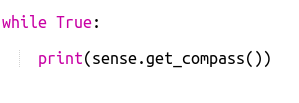
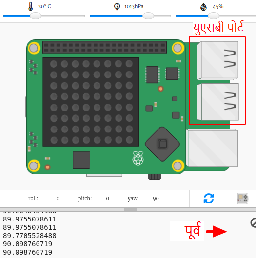
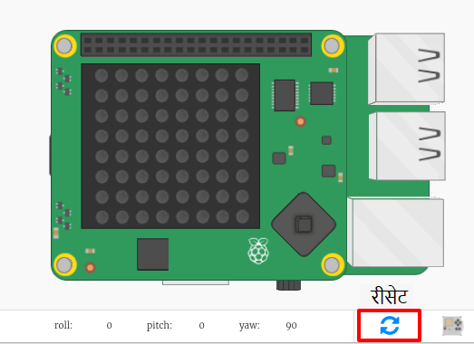

## होकायंत्राने दिशा शोधणे

Sense HAT मध्ये एक मॅग्नेटोमीटर आहे ज्याचा वापर उत्तर कोणत्या दिशेने आहे हे शोधण्यासाठी केला जाऊ शकतो.

इम्युलेटरमध्ये उत्तर दिशा तुमच्या स्क्रीनच्या शीर्षस्थानी संबंधित आहे. Sense HAT ने होकायंत्रची उत्तरेकडून अंशात नोंद केली आहे.

येथे होकायंत्रातील सूचनांचे स्मरण आहे:

+ होकायंत्र चक्रव्यूह Starter Trinket उघडा: <a href="http://jumpto.cc/compass-go" target="_blank">jumpto.cc/compass-go</a>.

+ Sense HAT कोणती दिशा दर्शवित आहे ते शोधा. `main.py` च्या तळाशी खालील कोड जोडा:
    
    

+ होकायंत्र हेडिंग पाहण्यासाठी तुमचा कोड रन करा - उत्तरेकडील दिशेने किती अंश तुम्ही आहात.
    
    
    
    त्याच्या सुरुवातीच्या स्थितीत Sense HAT पूर्व दिशेला जात आहे आणि तुम्ही सुमारे 90 अंशांची मूल्ये पाहिली पाहिजे.
    
    दिशा यूएसबी पोर्टवर आधारित आहे.

+ दिशा बदलण्यासाठी Sense HAT ला सुमारे खेचा.
    
    
    
    भिन्न दिशानिर्देश शोधण्याचा प्रयत्न करा:
    
    + उत्तरेकडे: सुमारे 360 किंवा 0 अंश 
    + पूर्वेकडे: सुमारे 90 अंश
    + दक्षिणेकडे: सुमारे 180 अंश
    + पश्चिमेकडे: सुमारे 270 अंश

+ तुम्ही गोंधळात पडल्यास Sense HAT ला त्याच्या सुरूवातीच्या स्थितीत परत ठेवण्यासाठी तुम्ही नेहमी रीसेट बटणावर क्लिक करू शकता.
    
    