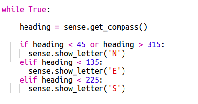
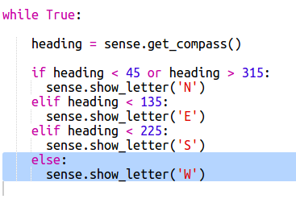

## होकायंत्राने दिशा दाखविणे

पुढे होकायंत्र दिशा, N, E, S किंवा W Sense HAT स्क्रीनवर दर्शवू.

जर होकायंत्र हेडिंग 315 आणि 45 डिग्रीच्या दरम्यान असेल तर Sense HAT उत्तर दिशेला निर्देशित करेल आणि तुम्हाला 'N' प्रदर्शित करायचा आहे. जर हेडिंग 45 ते 135 च्या दरम्यान असेल तर तुम्हाला 'E' प्रदर्शित करायचा आहे वगैरे वगैरे.

+ प्रथम जर Sense HAT उत्तर दिशेने जात असल्यास स्क्रीनवर N दाखवू.
    
    लक्षात ठेवा जेव्हा Sense HAT उत्तर दिशेने जात असेल तेव्हा यूएसबी पोर्ट सर्वात वर आहेत:
    
    

+ जर होकायंत्र हेडिंग 45 आणि 135 दरम्यान असेल तर 'N' प्रदर्शित करण्यासाठी तुमचा कोड बदला:
    
    

+ तुमच्या होकायंत्राची चाचणी घेण्यासाठी Sense HAT ला उत्तरेकडे (स्क्रीनच्या शीर्षस्थानी यूएसबी पोर्ट) ड्रॅग करा.
    
    

'N' अदृश्य होणार नाही, तुम्हाला इतर दिशानिर्देशांसाठी कोड जोडण्याची आवश्यकता आहे.

+ हं, 'N' बाजूला आहे. हे अक्षर यूएसबी पोर्टच्या दिशेने असणे अधिक अर्थपूर्ण आहे.
    
    Sense HAT स्क्रीन फिरविण्यासाठी खालील कोड जोडा.
    
    
    
    आता होकायंत्र अक्षर यूएसबी पोर्ट बरोबर जाईल ज्यामुळे Sense HAT ला होकायंत्र म्हणून वापरताना अधिक अर्थ प्राप्त होईल.

+ आता स्क्रीनवर E दाखवू जर Sense HAT पूर्व दिशेने जात असेल. जर तुम्ही उत्तरेकडे तोंड करत नाही आहात तर हेडिंग 45 डिग्री पेक्षा जास्त असणे आवश्यक आहे जेणेकरून तुम्ही ते 135 पेक्षा कमी असल्याचे तपासू शकता:
    
    

+ दक्षिणेसाठी कोड जोडा. अट काय असणे आवश्यक आहे यासाठी होकायंत्र कार्य करत आहे ते पहा.

+ तुमचा कोड असा दिसला पाहिजे:
    
    

+ आता पश्चिमेसाठी कोड जोडा. ते उत्तर, पूर्व किंवा दक्षिण नाही तर ते पश्चिम असले पाहिजे! तुम्ही फक्त एक 'else' (एल्स) वापरू शकता.
    
    

+ Sense HAT ला आजू बाजूला ड्रॅग करुन तुमच्या कोडची चाचणी करून घ्या.
    
    तुम्ही Sense HAT होकायंत्र बनविला आहे!