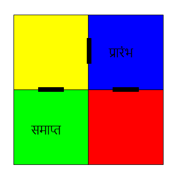
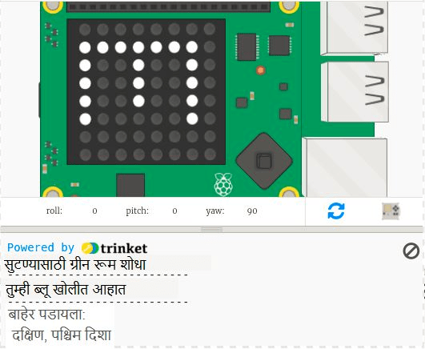

## चक्रव्यूहमधून नॅव्हिगेट करणे

आता चक्रव्यूहाभोवती नेव्हिगेट करण्यासाठी होकायंत्र वापरू.

चक्रव्यूव्हामधील खोल्या आणि दारे या नकाशामध्ये दर्शविल्याप्रमाणे आहेत:

तुम्ही निळ्या खोलीत प्रारंभ करा आणि बाहेर येण्यासाठी ग्रीन रूम शोधणे आवश्यक आहे.

+ एक साधा साहसी खेळ तयार करण्याचा कोड (आरपीजी प्रोजेक्ट प्रमाणे) तुमच्या प्रोजेक्टमधील maze.py मध्ये आहे.
    
    `maze.py` मध्ये चक्रव्यूह खेळ लिहिण्यास तुम्हाला मदत करण्यासाठी काही functions (फंक्शन) आहेत:
    
    + `maze.start()` - खेळ सुरू होतो
    + `maze.escaped()` - खेळाडू चक्रव्यूहातून सुटला आहे की नाही हे तुम्हाला सांगतो
    + `maze.walk(dir)` - खेळाडूला दिलेल्या दिशेने हलवते
    + `maze.getColour()` - तुम्ही सध्या असलेल्या खोलीतला रंग देते
    
    तुम्हाला `maze.py` इंपोर्ट करण्याची आवश्यकता असेल:
    
    

+ `maze.start()` सह खेळ सुरु करा:
    
    

+ तुम्हाला Sense HAT च्या खाली खेळाच्या सूचना दिसतील.
    
    

+ ज्या दिशेने तुम्ही जाऊ इच्छित आहात त्याबरोबर चक्रव्यूहभोवती फिरण्यासाठी तुम्हाला `maze.walk(dir)` वापरण्याची आवश्यकता आहे.
    
    वर्तमान होकायंत्र दिशा `dir` व्हेरिएबल मध्ये ठेवा, तुम्हाला प्रत्येक होकायंत्र दिशेने ते सेट करणे आवश्यक आहे:
    
    

+ आता जेव्हा खेळाडू जॉयस्टिकवर मध्य भागातील बटण दाबतो तेव्हा Sense HAT होकायंत्राने निर्देशित केलेल्या दिशेने त्याला हलवूया.
    
    

+ होकायंत्र वापरुन चक्रव्यूहभोवती फिरण्याचा प्रयत्न करा.
    
    जॉयस्टिकवर दाबण्यासाठी तुम्हाला Sense HAT विंडोमध्ये क्लिक करणे आवश्यक आहे आणि नंतर कीबोर्डवरील एंटर (रिटर्न) दाबा.

+ तुमच्या प्रोजेक्टची चाचणी तुम्ही Sense HAT ला ज्या दिशेकडे तुम्ही जाऊ इच्छिता त्या दिशेने हलवून आणि नंतर कीबोर्डवरील एंटर टॅप करून करा.
    
    तुम्हाला ग्रीन खोली शोधण्यासाठी मदत हवी असल्यास नकाशा पहा.

+ जेव्हा खेळाडू ग्रीन खोलीमध्ये पोहचतो तेव्हा ते चक्रव्यूहातून बाहेर पडण्यास यश मिळवितात. चला जेव्हा ते खेळ जिंकतात तेव्हा स्क्रीन हिरवा करूया आणि खेळ समाप्त करूया:
    
    
    
    `break` लूप संपवून खेळ समाप्त करतो.