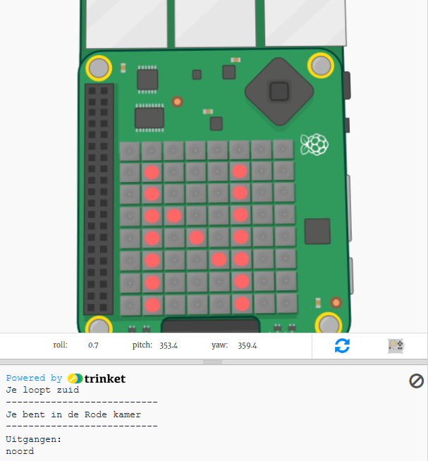

## Inleiding:

In dit project gebruik je de Sense HAT als kompas om uit een doolhof van kleurrijke kamers te navigeren. Je zult de Sense HAT moeten laten wijzen in de richting die je wilt bewegen en vervolgens op de knop in het midden van de joystick moeten drukken om een zet te doen.

  <iframe src="https://trinket.io/embed/python/db88d2a54f?outputOnly=true&start=result" width="600" height="500" frameborder="0" marginwidth="0" marginheight="0" allowfullscreen mark="crwd-mark">
</iframe> 

Om het spel te spelen druk je op Run en lees je de tekst in het trinket-uitvoervenster.

Je huidige kompasrichting verschijnt op het Sense HAT-display (N, Z, O of W.). Je kunt van richting veranderen door de Sense HAT in de emulator te bewegen.

Wanneer je in de richting kijkt die je wilt gaan, druk je op de middelste knop op de joystick door op Enter op het toetsenbord te drukken.

### Aanvullende informatie voor clubleiders

Als je dit project wilt afdrukken, gebruik dan de [printervriendelijke versie](https://projects.raspberrypi.org/nl-NL/projects/compass-maze/print).

--- collapse ---
---
title: Opmerkingen voor docenten
---

## Inleiding:

In dit project leren kinderen de Sense HAT-magnetometer (kompas) te gebruiken en de kompasrichting te gebruiken om door een doolhof te navigeren.

## Online bronnen

**Dit project maakt gebruik van Python 3.** We raden aan om [Trinket](https://trinket.io/) te gebruiken om Python online te schrijven. Dit project bevat de volgende Trinkets:

* ['Kompasdoolhof' start Trinket - trinket.io/python/bc18df0469](https://trinket.io/python/bc18df0469)

Er is ook een trinket met het voltooide project:

* ['Kompasdoolhof' voltooid - trinket.io/python/db88d2a54f](https://trinket.io/python/db88d2a54f)

## Offline bronnen

Dit project kan ook [offline voltooid worden](https://www.codeclubprojects.org/en-GB/resources/physical-sense-hat/) op een Raspberry Pi-computer met een Sense HAT. Je kunt toegang krijgen tot de projectbronnen door op de koppeling 'Projectmaterialen' voor dit project te klikken. Deze link bevat een 'Projectbronnen'-sectie die bronnen bevat om dit project offline te voltooien. Zorg ervoor dat elk kind toegang heeft tot een kopie van deze bestanden. Dit gedeelte bevat de volgende bestanden:

* compass-maze/main.py
* compass-maze/maze.py

Je kunt ook een voltooide versie van dit project vinden in de sectie 'Vrijwilligersbronnen', die het volgende bevat:

* compass-maze-finished/main.py
* compass-maze-finished/maze.py

(Alle bovenstaande bronnen kunnen ook worden gedownload als project en als vrijwilliger `.zip` bestanden.)

## Leerdoelen

* Hoe de Sense HAT-magnetometer te gebruiken (`get_compass()`)

Dit project behandelt elementen uit de volgende onderdelen van het [Raspberry Pi Digital Making Curriculum](http://rpf.io/curriculum):

* [Combineer programmeerconstructies om een ​​probleem op te lossen.](https://www.raspberrypi.org/curriculum/programming/builder)

## Uitdagingen

* "Beloon de speler" - Toon een afbeelding op de LED's aan het einde van het spel;
* "Maak je eigen doolhof" - bewerk het doolhofwoordenboek om je eigen doolhof te maken.

--- /collapse ---

--- collapse ---
---
title: Projectmaterialen
---

## Projectbronnen

* [.zip-bestand met alle projectbronnen](resources/compass-maze-project-resources.zip)
* [Kompasdoolhof startproject](https://trinket.io/python/bc18df0469)
* [Offline start Python-bestand](resources/compass-maze-main.py)
* [Offline start Python-bestand met de doolhofcode](resources/compass-maze-maze.py)

## Clubleider bronnen

* [.zip-bestand met alle voltooide projectbronnen](resources/compass-maze-volunteer-resources.zip)
* [Online voltooid Trinket kompasdoolhof project](https://trinket.io/python/db88d2a54f)
* [compass-maze-finished/main.py](resources/compass-maze-finished-main.py)
* [compass-maze-finished/maze.py](resources/compass-maze-finished-maze.py)

--- /collapse ---