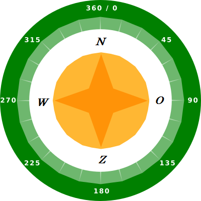
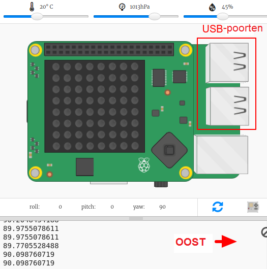
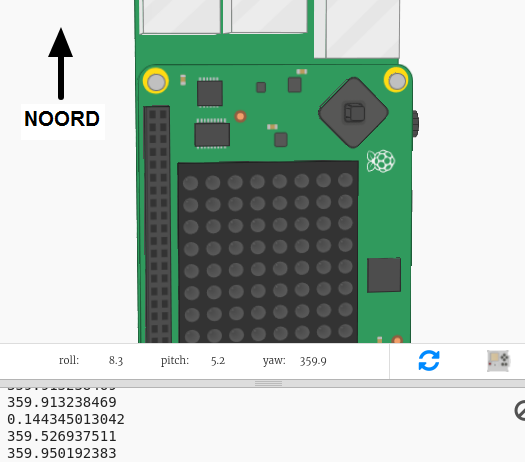

## De kompasrichting vinden

De Sense HAT bevat een magnetometer waarmee kan worden bepaald welke richting het noorden is.

In de emulator komt Noord overeen met de bovenkant van je scherm. De Sense HAT meldt een kompasrichting in graden vanuit het noorden.

Hier is een herinnering aan de windstreken:

+ Open de Kompasdoolhof start Trinket: <a href="https://trinket.io/python/bc18df0469" target="_blank">trinket.io/python/bc18df0469</a>.

+ Laten we eens kijken in welke richting de Sense HAT wijst. Voeg de volgende code toe onderaan `main.py`:
    
    

+ Voer je code uit om de kompasrichting te zien - hoeveel graden je bent vanaf het noorden.
    
    
    
    In de uitgangspositie is de Sense HAT naar het oosten gericht en zou je waarden van ongeveer 90 graden moeten zien.
    
    De richting is gebaseerd op de USB-poorten.

+ Sleep de Sense HAT rond om de richting te veranderen.
    
    
    
    Probeer verschillende richtingen te vinden:
    
    + Noord: rond 360 of 0 graden 
    + Oost: ongeveer 90 graden
    + Zuid: ongeveer 180 graden
    + West: ongeveer 270 graden

+ Als je in de war raakt, kun je altijd op de resetknop klikken om de Sense HAT terug in de uitgangspositie te zetten.
    
    