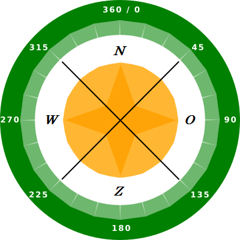
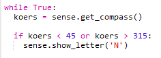
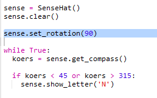
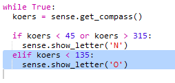
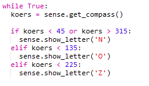
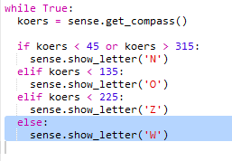

## Laat de kompasrichting zien

Laten we vervolgens de kompasrichting N, O, Z of W op het Sense HAT-scherm tonen.

Als de kompasrichting in graden tussen 315 en 45 ligt, wijst de Sense HAT naar het noorden en wil je een 'N' weergeven. Als de richting tussen 45 en 315 ligt, wil je een 'O' weergeven enzovoort.

+ Laten we eerst een N op het scherm tonen als de Sense HAT naar het noorden is gericht.
    
    Onthoud dat wanneer de Sense HAT naar het noorden is gericht, de USB-poorten zich bovenaan bevinden:
    
    

+ Wijzig je code om een 'N' weer te geven wanneer de kompasrichting tussen 45 en 135 ligt:
    
    

+ Sleep de Sense HAT naar het noorden (USB-poorten bovenaan het scherm) om je kompas te testen.
    
    

De 'N' verdwijnt niet, je moet code toevoegen voor de andere richtingen.

+ Hmm, de 'N' is op zijn kant. Het zou logischer zijn om de letter in dezelfde richting te laten wijzen als de USB-poorten.
    
    Voeg de volgende code toe om het Sense HAT-display te draaien.
    
    
    
    Nu wordt de kompasletter uitgelijnd met de USB-poorten, wat logischer is wanneer je de Sense HAT als kompas gebruikt.

+ Laten we nu een O op het scherm laten zien als de Sense HAT naar het oosten is gericht. Als je niet naar het noorden kijkt, moet de koers meer dan 45 graden zijn, dus je kunt gewoon controleren of deze minder dan 315 is:
    
    

+ Voeg de code voor zuid toe. Kijk naar het kompas om erachter te komen wat de voorwaarde is.

+ Je code zou er als volgt uit moeten zien:
    
    

+ Voeg nu de code voor west toe. Als het niet noord, oost of zuid is, dan moet het wel west zijn! Je kunt gewoon een "else" gebruiken.
    
    

+ Test je code door de Sense HAT rond te slepen.
    
    Je hebt een Sense HAT-kompas gemaakt!