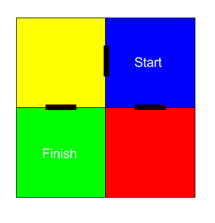
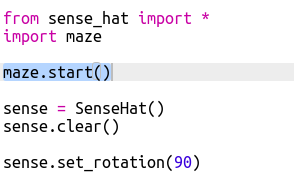
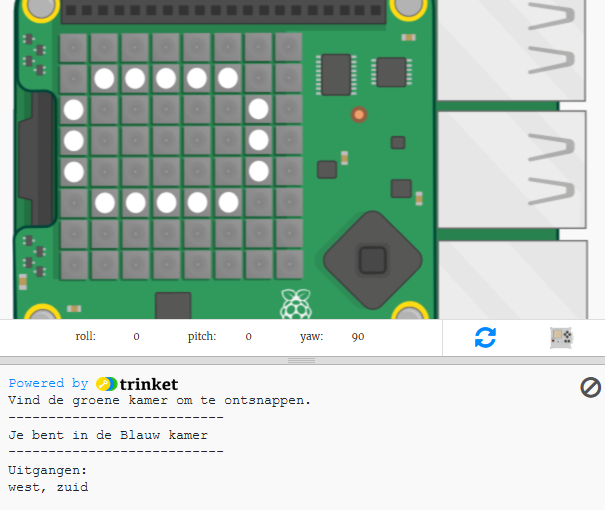
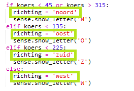
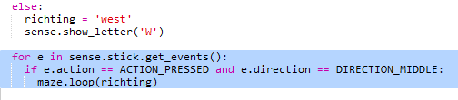
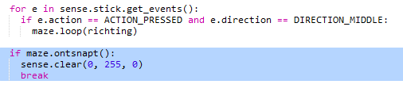

## Navigeren door het doolhof

Laten we nu het kompas gebruiken om door een doolhof te navigeren.

De kamers en deuren in het doolhof zijn zoals weergegeven op deze kaart:

Je begint in de blauwe kamer en moet de groene kamer vinden om te ontsnappen.

+ De code voor het maken van een eenvoudig avonturenspel (zoals die in het RPG-project) staat in maze.py in je project.
    
    `maze.py` bevat enkele functies om je te helpen een doolhofspel te schrijven:
    
    + `maze.start()` - start het spel
    + `maze.ontsnapt()` - vertelt je of de speler is ontsnapt aan het doolhof
    + `maze.loop(richting)` - beweegt de speler in de aangegeven richting
    + `maze.geefKleur()` - geeft je de kleur van de huidige kamer
    
    Je moet `maze.py` importeren:
    
    

+ Start het spel met `maze.start()`:
    
    

+ Je ziet de spelinstructies onder de Sense HAT verschijnen.
    
    

+ Om door het doolhof te bewegen moet je `maze.loop(richting)` gebruiken met de richting waarin je wilt bewegen.
    
    Zet de huidige kompasrichting in een `richting` variabele, je moet deze voor elke kompasrichting instellen:
    
    

+ Laten we de speler nu laten bewegen in de richting waarin het Sense HAT-kompas wijst wanneer ze op de middelste knop op de joystick drukken.
    
    

+ Probeer met het kompas door het doolhof te bewegen.
    
    Om op de joystick te drukken, klik je in het Sense HAT-venster en druk je op Enter (Return) op het toetsenbord.

+ Test je project door de Sense HAT te verplaatsen in de richting waarin je wilt bewegen en vervolgens op Enter op het toetsenbord te tikken.
    
    Kijk op de kaart als je hulp nodig hebt om de groene kamer te vinden.

+ Wanneer de speler de groene kamer bereikt, is hij erin geslaagd om uit het doolhof te ontsnappen. Laten we het scherm groen maken als ze winnen en het spel beëindigen:
    
    
    
    De `break` beëindigd de lus om het spel te beëindigen.