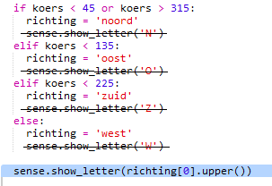
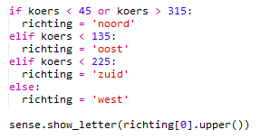
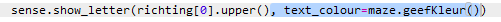
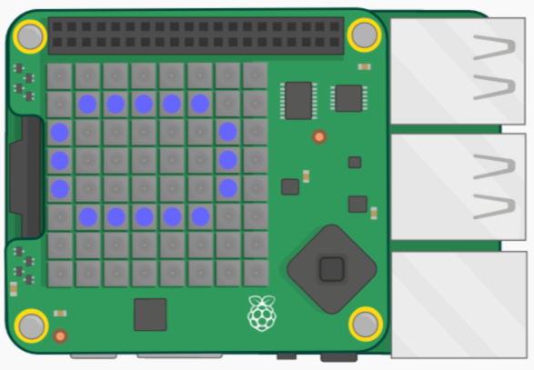

## Voeg kleuren toe

Het zou beter zijn als je kon zien in welke kamer je was door gewoon naar de Sense HAT te kijken.

Laten we de kompasletter weergeven in de kleur van de huidige kamer.

Als je bijvoorbeeld in de blauwe kamer bent en op het zuiden gericht bent, zou je een blauwe letter Z moeten zien.

+ Je moet een `text_colour` (tekstkleur) meegeven aan `sense.show_letter`. In plaats van dat vier keer te doen, verander je de code om de richting-variabele te gebruiken om de letter te bepalen die op de Sense HAT moet worden weergegeven.
    
    `richting[0].upper()` neemt de eerste letter van een tekenreeks en verandert deze in een hoofdletter dus "noord" geeft je 'N'.
    
    Wijzig je kompascode om `show_letter` één keer te gebruiken:
    
    

+ Je kompascode zou er als volgt uit moeten zien:
    
    

+ Gebruik nu de kleur van de huidige kamer wanneer je de kompasletter weergeeft:
    
    

+ Test je code en je zult zien dat je aan de kleur van de letter kunt zien in welke kamer je je bevindt.
    
    