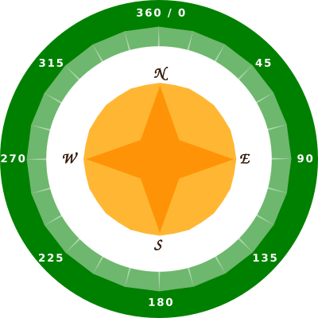

## Finding the compass direction

The Sense HAT contains a magnetometer that can be used to work out which direction is North.

In the emulator North corresponds to the top of your screen. The Sense HAT reports a compass heading in degrees from North.

Here's a reminder of the points of a compass:

+ Open the Compass Maze Starter Trinket: <a href="http://jumpto.cc/compass-go" target="_blank">jumpto.cc/compass-go</a>.

+ Let's find out which direction the Sense HAT is pointing in. Add the following code to the bottom of `main.py`:
    
    

+ Run your code to see the compass heading - how many degrees you are from facing north.
    
    
    
    In its starting position the Sense HAT is facing east and you should see values of about 90 degrees.
    
    The direction is based on the USB ports.

+ Drag the Sense HAT around to change its direction.
    
    
    
    Try finding different directions:
    
    + North: Around 360 or 0 degrees 
    + East: Around 90 degrees
    + South: Around 180 degrees
    + West: Around 270 degrees

+ If you get in a muddle you can always click the reset button to put the Sense HAT back into its starting position.
    
    