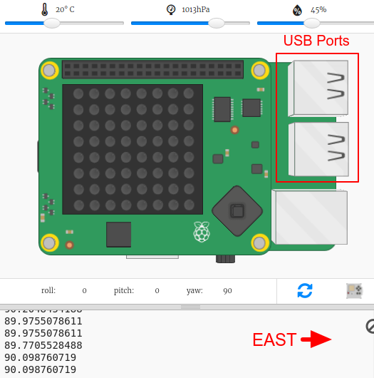
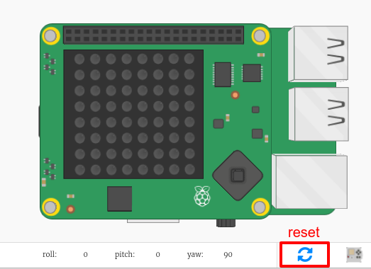

## Găsirea direcției busolei

Sense HAT conține un magnetometru care poate fi folosit pentru a determina ce direcție este Nordul.

În emulator, Nordul corespunde cu partea de sus a ecranului. Sense HAT raportează o rubrică a busolei în grade din nord.

Iată un memento a punctelor unei busole:

+ Deschideți trinket-ul de lansare al labirintului compas: <a href="http://jumpto.cc/compass-go" target="_blank">jumpto.cc/compass-go</a>.

+ Hai să aflăm în ce direcție indică Sense HAT. Adăugați următorul cod în partea de jos a `main.py`:
    
    

+ Rulați codul pentru a vedea poziția busolă - câte grade sunteți de la nord.
    
    
    
    În poziția sa inițială, Sense HAT se îndreaptă spre est și ar trebui să vedeți valori de aproximativ 90 de grade.
    
    Direcția se bazează pe porturile USB.

+ Trageți Sense HAT în jur pentru a schimba direcția.
    
    
    
    Încercați să găsiți direcții diferite:
    
    + Nord: Aproximativ 360 grade sau 0 grade 
    + Est: Aproximativ 90 de grade
    + Sud: Aproximativ 180 de grade
    + Vest: Aproximativ 270 de grade

+ Dacă intri într-o confuzie, poți oricând să dai clic pe butonul de resetare pentru a pune Sense HAT înapoi în poziția sa inițială.
    
    