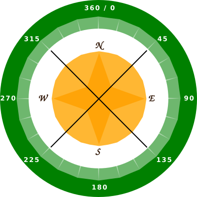
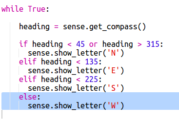

## Se afișează direcția busolă

Înainte să arătăm direcția busolă, N, E, S sau W, pe ecranul Sense HAT.

Dacă titlul busolei în grade este între 315 și 45, atunci Sense HAT indică spre nord și doriți să afișați un "N". Dacă titlul este între 45 și 315, atunci doriți să afișați un "E" și așa mai departe.

+ Mai întâi să arătăm un N pe ecran când Sense HAT se îndreaptă spre nord.
    
    Rețineți că atunci când Sense HAT se îndreaptă spre nord, porturile USB se află în partea de sus:
    
    

+ Modificați codul pentru a afișa un "N" când titlul compasului este între 45 și 135:
    
    

+ Trageți Sense HAT spre nord (porturile USB din partea superioară a ecranului) pentru a testa busola.
    
    

"N" nu va dispărea, trebuie să adăugați cod pentru celelalte direcții.

+ Hmm, "N" este în lateral. Ar fi mai logic să aveți scrisoarea îndreptată în aceeași direcție ca porturile USB.
    
    Adăugați următorul cod pentru a roti ecranul Sense HAT.
    
    
    
    Acum, scrisoarea compasului va fi aliniată cu porturile USB, ceea ce face mai multă sens când se utilizează Sense HAT ca busolă.

+ Acum, să arătăm un E pe ecran când Sense HAT se îndreaptă spre est. Dacă nu vă confruntați cu nordul, atunci poziția trebuie să fie mai mare de 45 de grade, astfel încât să puteți verifica dacă este mai mică de 315:
    
    

+ Adăugați codul pentru sud. Uită-te la busola pentru a determina ce condiție trebuie să fie.

+ Codul dvs. ar trebui să arate astfel:
    
    

+ Acum adăugați codul pentru vest. Dacă nu este nord, est sau sud, atunci trebuie să fie spre vest! Puteți folosi doar "altceva".
    
    

+ Testați-vă codul trăgând Sense HAT în jur.
    
    Ai făcut o busolă Sense HAT!