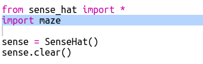
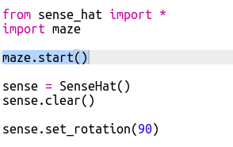
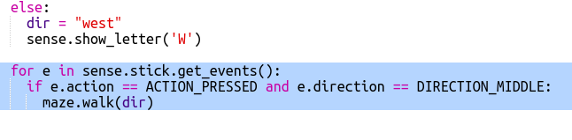

## Navigarea în labirint

Acum, să folosim compasul pentru a naviga în jurul unui labirint.

Camerele și ușile din labirint sunt prezentate în această hartă:

Începeți în camera Albastră și trebuie să găsiți camera Verde pentru a scăpa.

+ Codul pentru crearea unui simplu joc de aventură (precum cel din proiectul RPG) se află în maze.py în proiectul dvs.
    
    `maze.py` include câteva funcții pentru a vă ajuta să scrieți un joc de labirint:
    
    + `maze.start ()` - începe jocul
    + `maze.escaped ()` - vă spune dacă jucătorul a scăpat de labirint
    + `maze.walk (dir)` - Mută playerul în direcția dată
    + `maze.getColour ()` - vă oferă culoarea camerei curente
    
    Va trebui să importați `maze.py`:
    
    

+ Începeți jocul cu `maze.start ()`:
    
    

+ Veți vedea instrucțiunile jocului care apar sub Sense HAT.
    
    

+ Pentru a vă deplasa în labirint trebuie să utilizați `maze.walk (dir)` cu direcția în care doriți să vă mutați.
    
    Puneți direcția curentă a busolei într-o variabilă `dir` , va trebui să o setați pentru fiecare direcție a busolei:
    
    

+ Acum permiteți-l să se miște jucătorul în direcția în care compasul Sense HAT este îndreptat atunci când apasă butonul din mijloc de pe joystick.
    
    

+ Încercați să vă deplasați în labirint folosind busola.
    
    Pentru a apăsa pe joystick trebuie să faceți clic în fereastra Sense HAT și apoi apăsați Enter (Return) de pe tastatură.

+ Testați-vă proiectul mutând Sense HAT în direcția în care doriți să vă mutați și apoi atingând Enter de pe tastatură.
    
    Uită-te la hartă dacă ai nevoie de ajutor pentru a găsi camera verde.

+ Când jucătorul ajunge în camera verde, au reușit să scape de labirint. Să transformăm ecranul verde când câștigă și termină jocul:
    
    
    
    `pauză` a terminat bucla pentru a termina jocul.