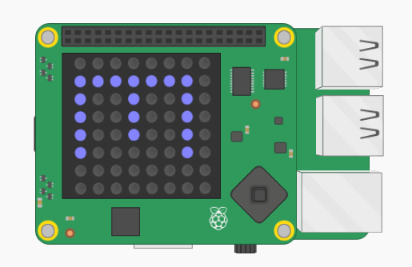

## Adăugați culori

Ar fi mai bine să-ți dai seama în ce cameră te-ai afla, doar uitându-te la Sense HAT.

Să afișăm litera busolă în culoarea camerei curente.

De exemplu, dacă vă aflați în camera albastră și orientată spre sud, ar trebui să vedeți o literă albastră S.

+ Va trebui să furnizeze un `text de culoare de` la cu `sense.show_letter`. Mai degrabă decât de patru ori, schimbați codul pentru a utiliza variabila dir pentru a elabora litera care să apară pe Sense HAT.
    
    `dir[0].upper ()` primește prima literă a unui șir și o transformă într-o capitală, astfel că "nord" vă dă "N".
    
    Schimbați codul de busolă pentru a utiliza `show_letter` dată:
    
    

+ Codul dvs. de busolă ar trebui să arate astfel:
    
    

+ Acum folosiți culoarea camerei curente când afișați litera bustei:
    
    

+ Testați-vă codul și ar trebui să găsiți că puteți spune care este camera din culoarea literei.
    
    